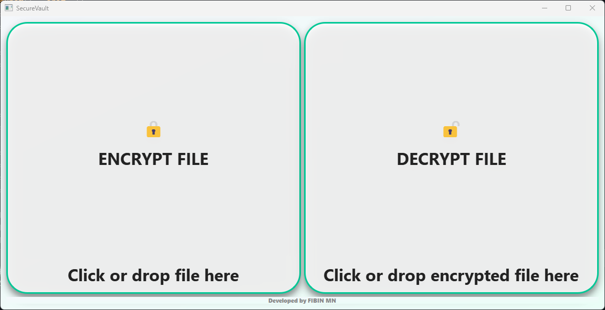
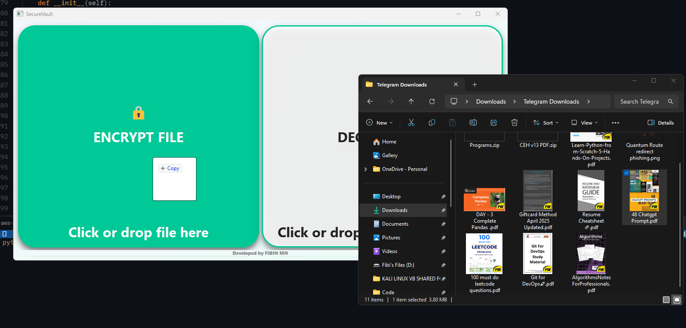
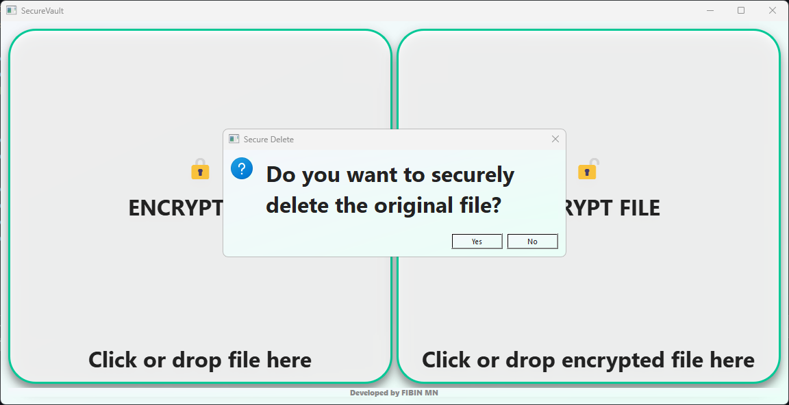
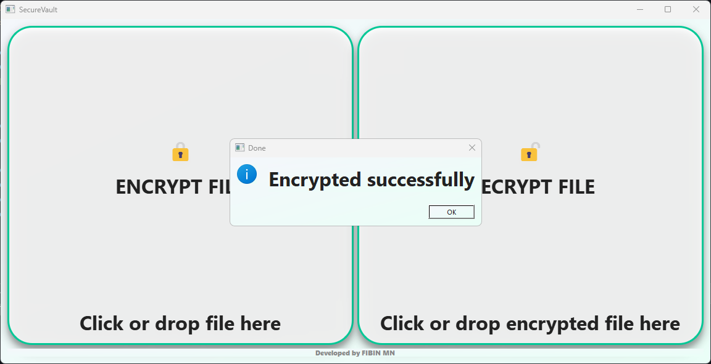
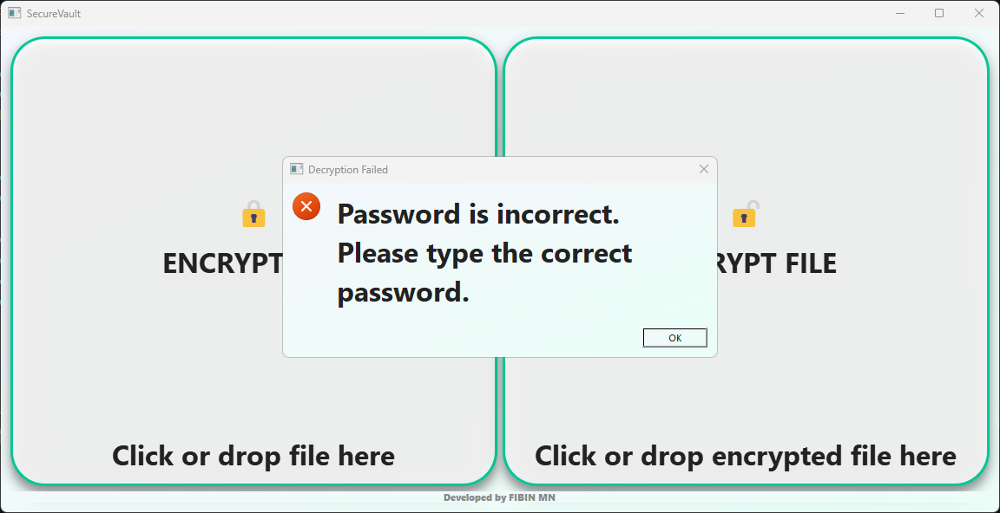
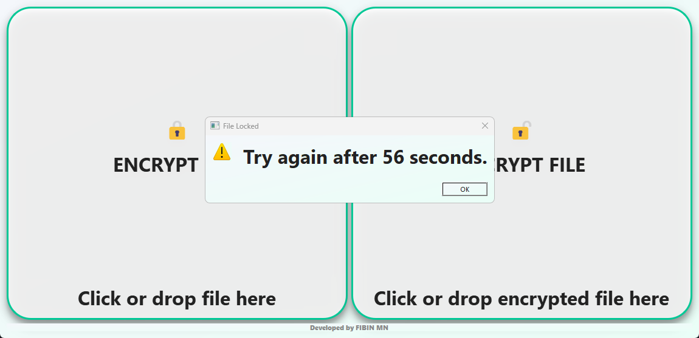
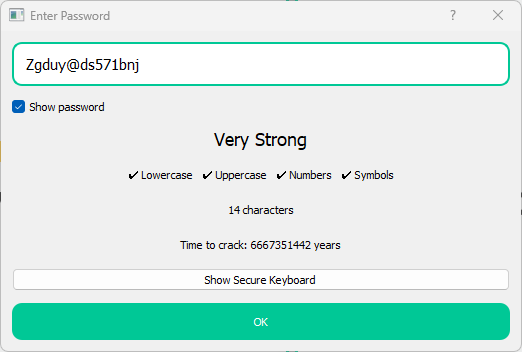
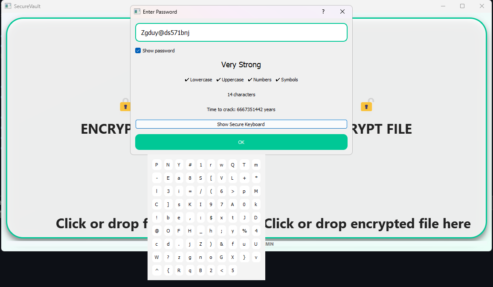

# 🔐 SecureVault – AES-256 Secure File Vault

A modern, desktop-grade secure file encryption system with enterprise-level security features, password hardening, and anti-bruteforce protection.

SecureVault allows you to encrypt and decrypt files locally using AES-256 encryption, ensuring your data remains confidential even if your device is compromised.


## ✨ Features

| Feature | Description |
|---------|-------------|
| **AES-256 Encryption** | Military-grade AES-256-GCM encryption for maximum security |
| **Password Strength Meter** | Real-time crack-time estimation with visual feedback |
| **Dynamic Password Validation** | Weak / Medium / Strong / Very Strong analysis |
| **Secure On-Screen Keyboard** | Prevents hardware & software keylogger capture |
| **Anti-Bruteforce Protection** | Progressive lockout timers after failed attempts |
| **Drag & Drop Support** | Drag files directly into the vault tiles |
| **Secure File Delete** | Cryptographically overwrites original file |
| **Tamper Detection** | SHA-256 integrity verification |
| **Modern UI** | Clean glass-style modern interface |
| **Metadata Sealing** | Encrypted files include integrity metadata |
| **Works Fully Offline** | No cloud dependency, complete local control |

## 🖥️ Screenshots

### Main Vault Interface
The main interface features two intuitive tiles for encryption and decryption operations with drag-and-drop support.

*Main UI :*



*Drag and Drop File :*



*Delete Original File Dialog :*



*Encryption & Decryption Success Message :*




*Incorrect Password Decryption Attempt :*



*Password Lockout :*




### Password Security Panel
Real-time password strength analysis with crack-time estimation, character requirements, and an optional secure keyboard.

*Encryption Password Enter Dialog :*

 *Password Strength Analysis :*




*Anti-Keylogger Secure Kayboard :*



*Decryption Password Enter Dialog :*


## 🏗️ Architecture

```
                    ┌─────────────────────────────┐
                    │      SecureVault UI         │
                    │    (PyQt5 Modern GUI)       │
                    └───────────────┬─────────────┘
                                    │
         ┌──────────────────────────┼──────────────────────────┐
         │                          │                          │
┌────────▼──────────┐   ┌───────────▼──────────┐   ┌───────────▼────────┐
│ Password Security │   │  Secure Keyboard     │   │  Lockout Manager   │
│ Strength Analyzer │   │ Anti-Keylogger Input │   │ Brute-Force Control│
└────────┬──────────┘   └───────────┬──────────┘   └─────────┬──────────┘
         │                          │                        │
┌────────▼──────────┐   ┌───────────▼──────────┐   ┌─────────▼──────────┐
│  Crypto Engine    │   │  Metadata Engine     │   │  Secure Delete     │
│ AES-256-GCM       │   │ Hash + Nonce + Salt  │   │ Random Overwrite   │
└────────┬──────────┘   └───────────┬──────────┘   └─────────┬──────────┘
         │                          │                        │
                   ┌────────────────▼────────────┐
                   │    Encrypted Storage        │
                   │  data/encrypted/*.enc       │
                   └─────────────────────────────┘
```

## 🔐 Encryption Flow

```
File → SHA-256 Hash → Salt + PBKDF2 Key Derivation → AES-256-GCM Encrypt → Save .enc file
```

## 🔓 Decryption Flow

```
Encrypted File → Metadata Validation → Password Verification → AES-256 Decrypt → Restore File
```

## 🚀 Installation

### Prerequisites
- Python 3.7 or higher
- pip (Python package manager)

### Install Dependencies

```bash
pip install -r requirements.txt
```

Or install manually:

```bash
pip install cryptography PyQt5
```

### Run the Application

```bash
python main.py
```

## 📖 Usage

### Encrypting a File

1. **Click or Drag**: Click the green "ENCRYPT FILE" tile or drag a file onto it
2. **Enter Password**: Use the password dialog to create a strong password
   - View real-time password strength analysis
   - Use the secure keyboard to prevent keylogging
3. **Secure Delete** (Optional): Choose whether to securely delete the original file
4. **Done**: Your encrypted file is saved in `data/encrypted/` with a `.enc` extension

### Decrypting a File

1. **Click or Drag**: Click the "DECRYPT FILE" tile or drag an `.enc` file onto it
2. **Enter Password**: Type the correct password used during encryption
3. **Success**: Your decrypted file is restored in `data/decrypted/`

### Password Strength Indicators

The password dialog provides real-time feedback:
- ✓ Lowercase letters
- ✓ Uppercase letters
- ✓ Numbers
- ✓ Symbols
- Character count
- Estimated crack time

**Strength Levels:**
- **Weak**: < 1 minute to crack (Red)
- **Medium**: < 1 hour to crack (Orange)
- **Strong**: < 1 year to crack (Green)
- **Very Strong**: > 1 year to crack (Teal)

## 🛡️ Security Features

### Anti-Bruteforce Protection

Progressive lockout system prevents password guessing attacks:

| Failed Attempts | Lock Time |
|----------------|-----------|
| 3 | 30 seconds |
| 6 | 1 minute |
| 9 | 5 minutes |
| 12 | 10 minutes |
| 15 | 15 minutes |
| 18+ | Up to 1 hour |

**Note**: Lockouts persist even if the application is restarted.

### Secure Keyboard

The randomized on-screen keyboard protects against:
- Hardware keyloggers
- Screen-logging malware
- Clipboard sniffers
- Shoulder surfing attacks

Keys are randomly shuffled with each use.

### Security Design Highlights

| Protection | Method |
|-----------|---------|
| **Key Derivation** | PBKDF2-HMAC-SHA256 (200,000 iterations) |
| **Encryption** | AES-256-GCM (Authenticated Encryption) |
| **Integrity** | SHA-256 hash verification |
| **Anti-Bruteforce** | Progressive lockout system |
| **Secure Deletion** | Cryptographic random overwrite |
| **Input Protection** | Randomized secure keyboard |
| **Metadata** | Encrypted with salt, nonce, and hash |

## 🗂️ Project Structure

```
SecureVault/
├── core/
│   ├── crypto_engine.py       # AES-256-GCM encryption/decryption
│   ├── lockout.py             # Bruteforce protection system
│   ├── metadata.py            # Metadata management
│   └── secure_delete.py       # Secure file deletion
├── ui/
│   ├── main_window.py         # Main application window
│   └── password_dialog.py     # Password input with strength meter
├── data/
│   ├── encrypted/             # Encrypted files storage
│   ├── decrypted/             # Decrypted files output
│   └── lockout/               # Lockout state persistence
├── screenshots/               # Application screenshots
├── reports/                   # Detailed reports
├── main.py                    # Application entry point
├── requirements.txt           # Python dependencies
└── README.md                  # This file
```

## 🔧 Technical Details

### Encryption Algorithm
- **Algorithm**: AES-256 in GCM mode (Galois/Counter Mode)
- **Key Size**: 256 bits
- **Authentication**: Built-in authenticated encryption
- **Nonce**: 12 bytes (96 bits), randomly generated per file

### Key Derivation
- **Function**: PBKDF2-HMAC-SHA256
- **Iterations**: 200,000 (OWASP recommended minimum)
- **Salt**: 16 bytes, randomly generated per file

### Integrity Verification
- **Hash Algorithm**: SHA-256
- **Verification**: Performed automatically during decryption
- **Protection**: Detects any tampering or corruption

## 🔒 Security Best Practices

### For Users
1. **Use Strong Passwords**: Aim for "Very Strong" rating (15+ characters with mixed case, numbers, and symbols)
2. **Store Passwords Safely**: Use a password manager for encrypted files
3. **Backup Encrypted Files**: Keep secure backups of your `.enc` and `.meta` files
4. **Secure Environment**: Use in a trusted environment free from malware
5. **Verify Integrity**: Check for successful decryption messages

### For Developers
1. **Never Store Keys**: Passwords are never stored, only derived on-demand
2. **Random Salts**: Each file gets a unique random salt
3. **Secure Deletion**: Original files can be cryptographically overwritten
4. **Error Handling**: Minimal information disclosure on failures
5. **No Network**: Operates entirely offline

## 🐛 Known Limitations

- Large files (>1GB) may take time to encrypt/decrypt
- No built-in password recovery (by design)
- Lockout data stored locally (can be bypassed by file system access)
- Secure delete may not work on SSDs with wear leveling

## 🤝 Contributing

Contributions are welcome! Please feel free to submit issues and pull requests.

## 👤 Author

**FIBIN MN**

## ⚠️ Disclaimer

This software is provided for educational and legitimate security purposes only. The author is not responsible for any misuse or damage caused by this program. Always ensure you have backups of important data and use strong, unique passwords.

## 🙏 Acknowledgments

- Built with [PyQt5](https://www.riverbankcomputing.com/software/pyqt/) for the GUI
- Uses [cryptography](https://cryptography.io/) library for encryption
- Inspired by modern security best practices

---

**⭐ If you find this project useful, please consider giving it a star!**


