# 🔎Basic Vulnerability Scan of PC

### Objective
Perform a comprehensive vulnerability assessment using OpenVAS to identify common security vulnerabilities on local systems and understand baseline security posture.

---

## Environment Setup

### Tools Used
- **Scanner**: OpenVAS (Greenbone Community Edition)
- **Platform**: Kali Linux VM
- **Scan Engine**: Greenbone Vulnerability Manager (GVM)
- **Web Interface**: Greenbone Security Assistant (GSA)

### Installation Process
```bash
sudo apt update
sudo apt install -y greenbone-community-edition
sudo gvm-setup
sudo gvm-start
```
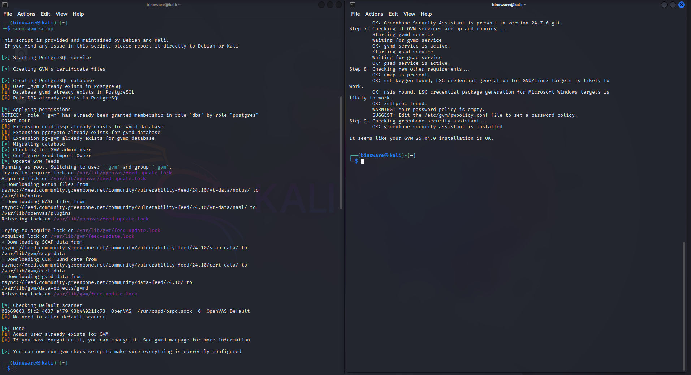

### Access Details
- **Web Interface**: https://127.0.0.1:9392
- **Setup Time**: Approximately 45-60 minutes for initial feed download and configuration

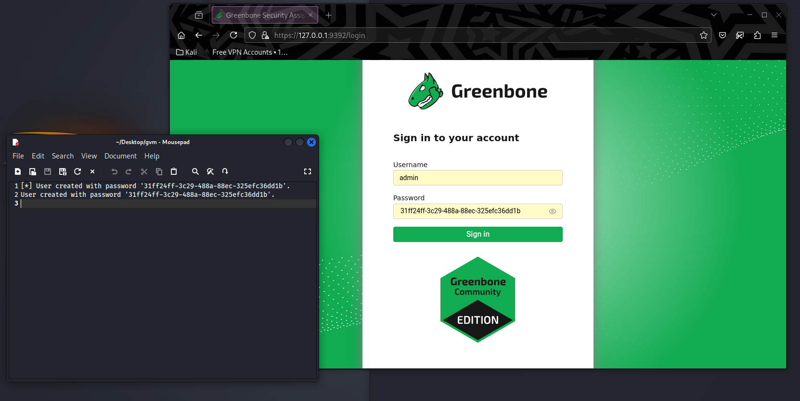

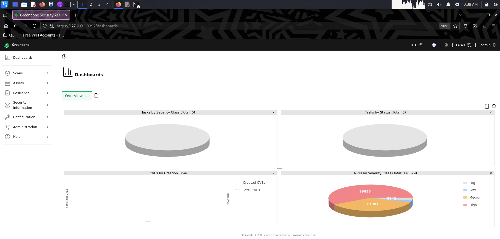

---

## Scan Configuration

### Scan Targets

#### Target 1: Kali Linux VM (Localhost)
- **IP Address**: 127.0.0.1
- **Scan Type**: Full and Fast
- **Task Name**: Full Vulnerability Scan – Localhost
- **Port List**: All IANA assigned TCP and UDP
- **Alive Test**: ICMP, TCP-ACK Service & ARP Ping

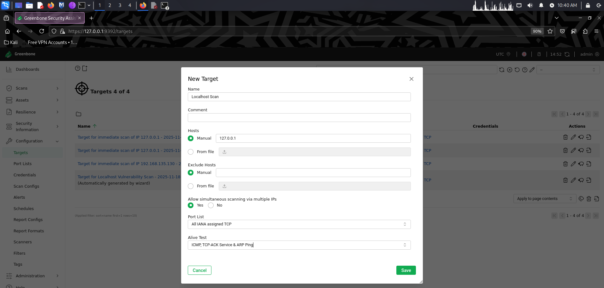

#### Target 2: Host Machine
- **IP Address**: 192.168.XX.XXX
- **Scan Type**: Full and Fast
- **Task Name**: Full Vulnerability Scan - Host machine from VM
- **Port List**: All IANA assigned TCP and UDP
- **Alive Test**: ICMP, TCP-ACK Service & ARP Ping

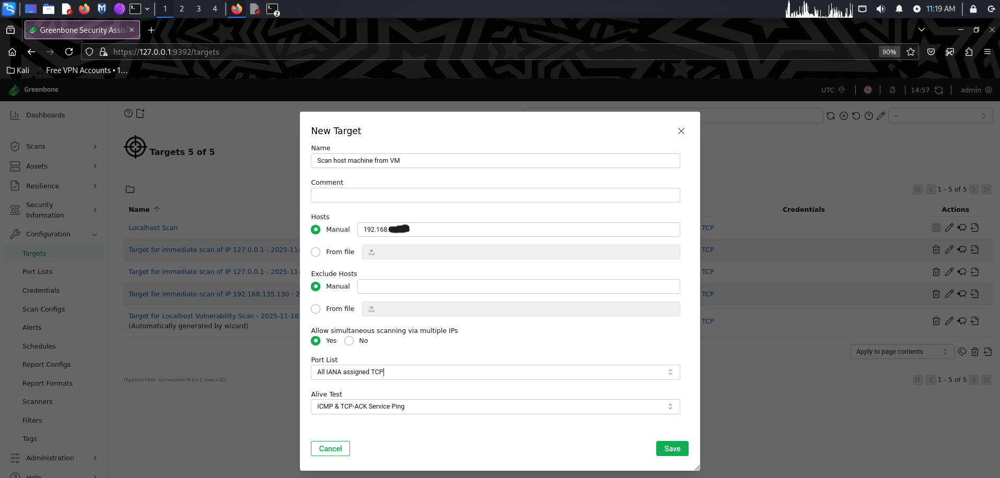

### Scan Timeline
- **Localhost Scan**
  - Started: Fri Dec 26 05:12:42 2025 UTC
  - Ended: Fri Dec 26 05:26:52 2025 UTC
  - Duration: ~14 minutes

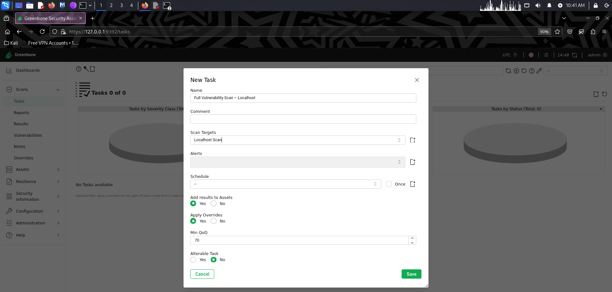

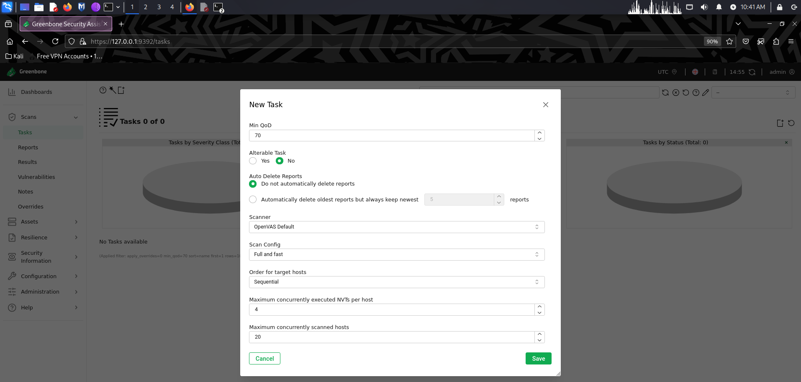

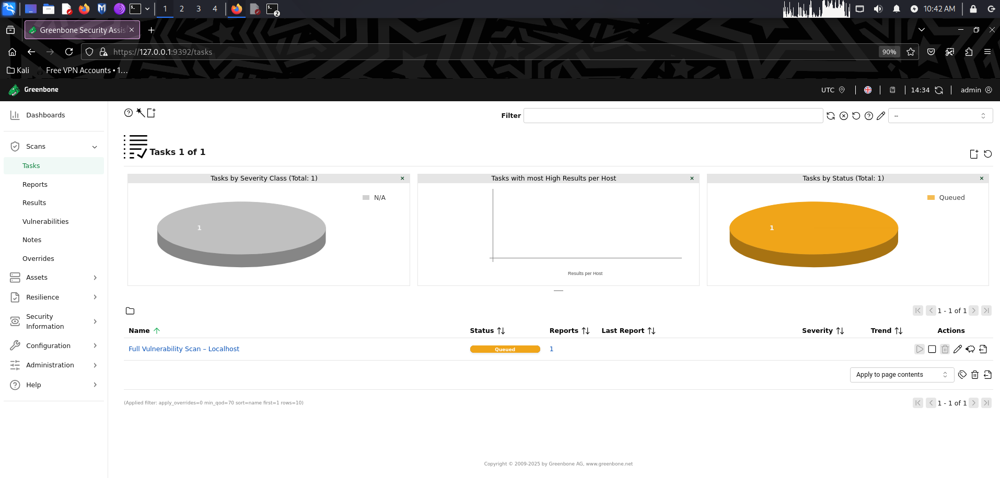

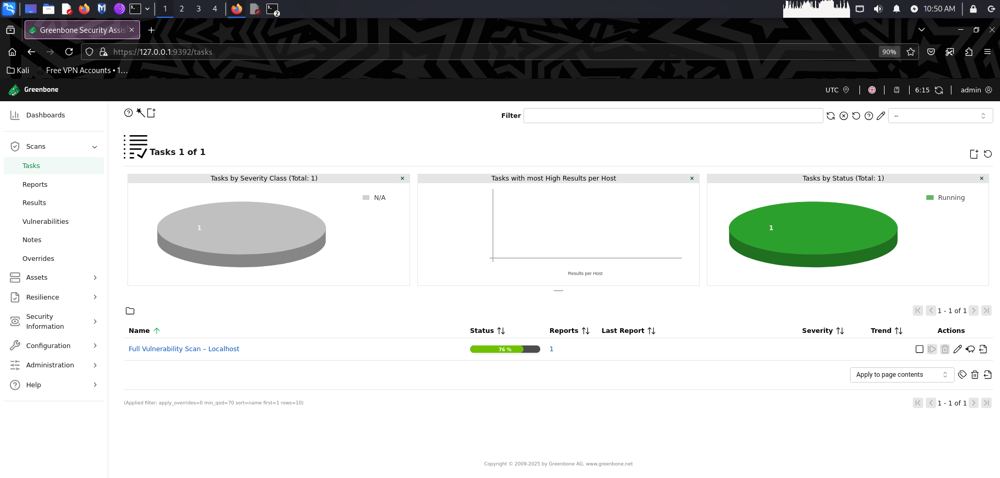

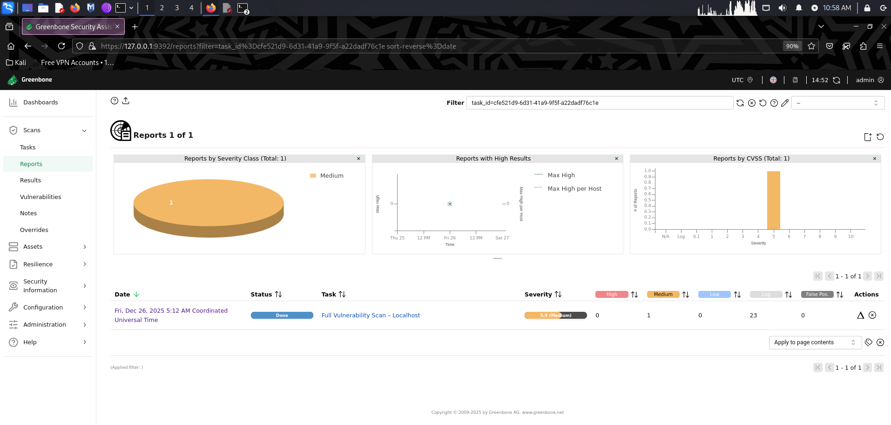

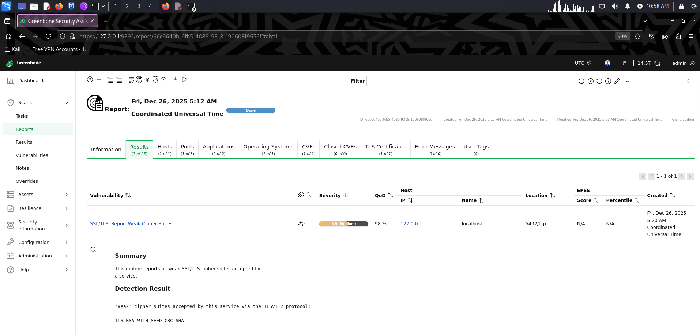

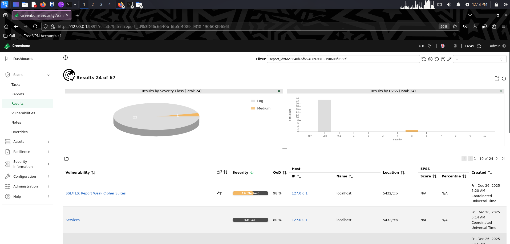

- **Host Machine Scan**
  - Started: Fri Dec 26 05:50:33 2025 UTC
  - Ended: Fri Dec 26 06:37:50 2025 UTC
  - Duration: ~47 minutes

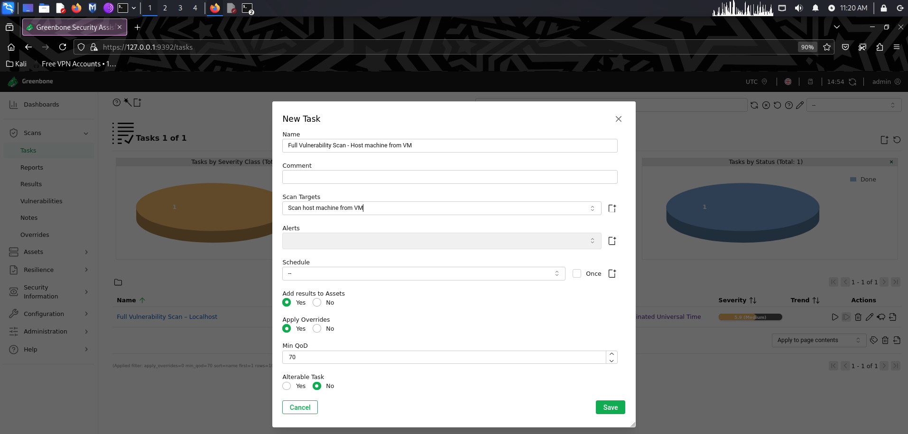

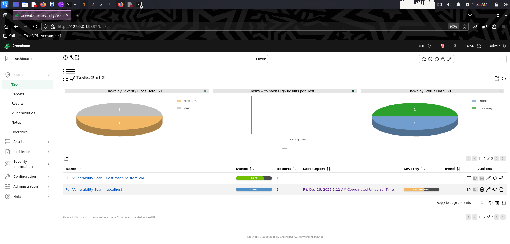

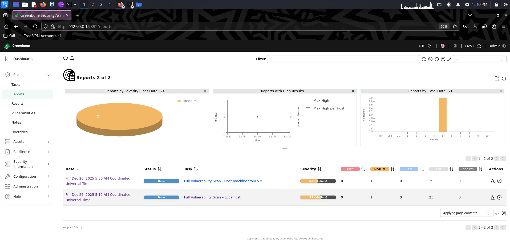

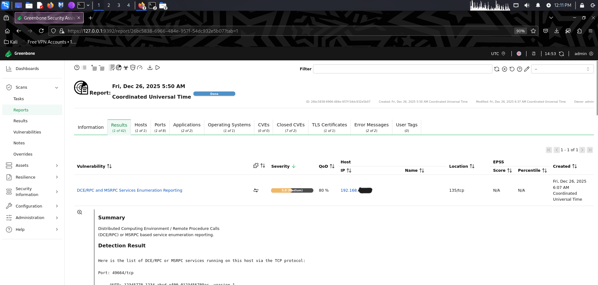

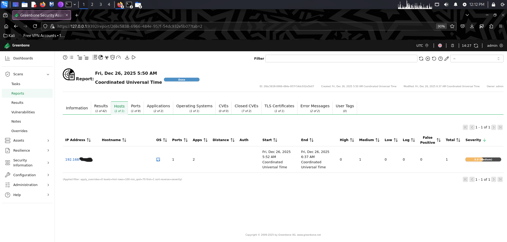


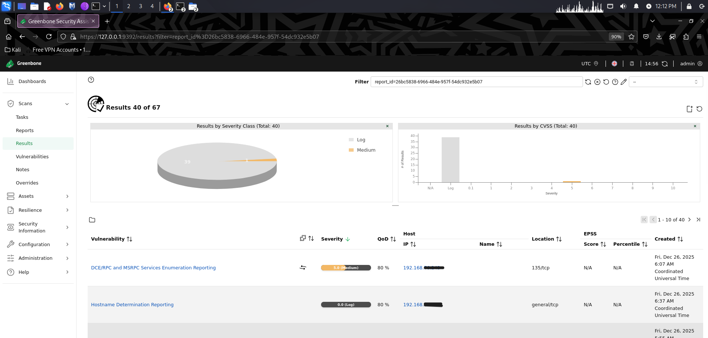

---

## Scan Results Summary

### Overall Security Posture

| Host | Critical | High | Medium | Low | Total Issues |
|------|----------|------|--------|-----|--------------|
| 127.0.0.1 (Kali VM) | 0 | 0 | 1 | 0 | 1 |
| 192.168.XX.XXX (Host) | 0 | 0 | 1 | 0 | 1 |

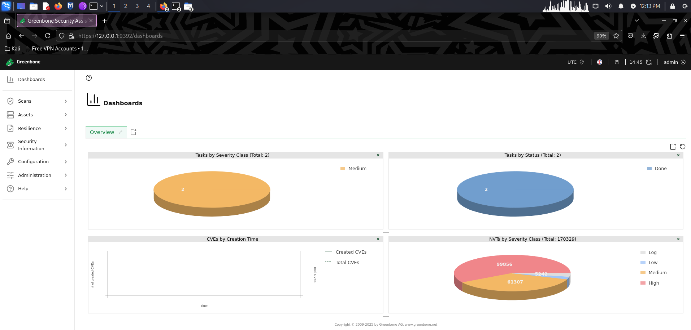

### Scan Reports
- [Kali Linux Localhost Scan Report](Kali-Localhost-Scan-Report.txt)
- [Host Machine Scan Report](Host-Machine-Scan-Report.txt)

**Key Finding**: No critical or high-severity vulnerabilities detected on either system, indicating a strong baseline security posture.

---

## Detailed Vulnerability Analysis

### 1. Kali Linux VM (127.0.0.1)

#### Vulnerability: SSL/TLS Weak Cipher Suites
- **NVT**: SSL/TLS: Report Weak Cipher Suites
- **OID**: 1.3.6.1.4.1.25623.1.0.103440
- **Severity**: Medium
- **CVSS Score**: 5.9
- **Affected Port**: 5432/tcp (PostgreSQL)
- **Protocol**: TLSv1.2
- **Weak Cipher Identified**: TLS_RSA_WITH_SEED_CBC_SHA

**Technical Details**:
- Port 5432 is PostgreSQL's default port
- Greenbone/OpenVAS uses PostgreSQL as its backend database
- The scanner effectively detected a weakness in its own backend service
- This is expected behavior in default Kali Linux installations

**Impact**:
- Potential for cryptographic downgrade attacks
- Weaker encryption may allow sensitive information disclosure
- Remote attackers could exploit weak cipher negotiation

**Risk Assessment**:
- **Actual Risk**: Low in isolated lab environment
- **Production Risk**: Medium if exposed to external networks
- **Current Exposure**: Service bound to localhost only

**Mitigation Strategies**:
1. **Disable Weak Cipher Suites**
   ```bash
   # Edit PostgreSQL configuration
   sudo nano /etc/postgresql/*/main/postgresql.conf
   # Add: ssl_ciphers = 'HIGH:MEDIUM:+3DES:!aNULL'
   ```

2. **Restrict TLS Versions**
   - Enforce TLS 1.2+ minimum
   - Disable TLS 1.0 and 1.1

3. **Network Hardening**
   - Bind PostgreSQL to localhost only (default)
   - Implement firewall rules blocking external access to port 5432

4. **Service Isolation**
   ```bash
   # Verify PostgreSQL is localhost-only
   sudo netstat -tlnp | grep 5432
   ```

**Why This Can Remain Unfixed**:
- Service is not exposed to external networks
- Kali Linux is a penetration testing distribution, not a production system
- No direct attack surface from outside the VM
- Firewall provides additional protection layer

**References**:
- CVE-2013-2566 (RC4 cipher vulnerabilities)
- CVE-2015-2808 (RC4 attacks)
- CVE-2015-4000 (Logjam attack)
- [Mozilla SSL Configuration Generator](https://ssl-config.mozilla.org)
- [BSI TR-02102-1](https://www.bsi.bund.de/SharedDocs/Downloads/EN/BSI/Publications/TechGuidelines/TG02102/BSI-TR-02102-1.html)

---

### 2. Host Machine (192.168.XX.XXX)

#### Vulnerability: DCE/RPC and MSRPC Services Enumeration
- **NVT**: DCE/RPC and MSRPC Services Enumeration Reporting
- **OID**: 1.3.6.1.4.1.25623.1.0.10736
- **Severity**: Medium
- **CVSS Score**: 5.0
- **Affected Port**: 135/tcp (Windows RPC Endpoint Mapper)
- **Classification**: Information Disclosure

**Technical Details**:

**Enumerated Services and Processes**:

| Port | Service/Process | Description | Security Implication |
|------|----------------|-------------|---------------------|
| 49664/tcp | lsass.exe | SAM access, Ngc Pop Key Service, KeyIso | Authentication and credential management |
| 49665/tcp | Generic RPC | Unknown service | Potential reconnaissance vector |
| 49666/tcp | Generic RPC | Unknown service | Potential reconnaissance vector |
| 49667/tcp | Windows Event Log | System logging service | Event log access |
| 49668/tcp | spoolsv.exe | Print Spooler service | Known attack vector (PrintNightmare) |
| 50841/tcp | Generic RPC | Unknown service | Potential reconnaissance vector |

**Critical Services Exposed**:
- **lsass.exe** (Local Security Authority Subsystem Service)
  - Handles authentication
  - Stores credentials in memory
  - High-value target for attackers

- **spoolsv.exe** (Print Spooler)
  - Historically vulnerable (CVE-2021-34527 PrintNightmare)
  - Can be leveraged for privilege escalation
  - Common lateral movement vector

- **Windows Event Log**
  - Allows log enumeration
  - Can reveal system activity patterns

**Impact**:
- **Reconnaissance Enhancement**: Attackers gain detailed service information
- **Attack Surface Mapping**: Exposed services reveal potential entry points
- **Lateral Movement Assistance**: After initial compromise, aids in network traversal
- **Privilege Escalation Path**: Services like Print Spooler have known vulnerabilities

**Risk Assessment**:
- **Direct Exploitability**: Low (not directly exploitable alone)
- **Reconnaissance Value**: High (enables informed attack planning)
- **Post-Compromise Risk**: Medium to High (assists lateral movement)
- **Current Context**: Acceptable for private LAN environments

**Important Distinction**:
This is **NOT an exploit vulnerability**. This is an **information disclosure** issue that:
- Does not directly compromise the system
- Requires additional attack vectors for exploitation
- Is standard behavior for Windows in LAN environments
- Provides reconnaissance data to potential attackers

**Mitigation Strategies**:

1. **Network Segmentation**
   ```powershell
   # Windows Firewall rule to restrict RPC
   New-NetFirewall Rule -DisplayName "Block RPC from Untrusted Networks" `
       -Direction Inbound -LocalPort 135 -Protocol TCP `
       -Action Block -RemoteAddress !192.168.76.0/24
   ```

2. **Firewall Hardening**
   - Block port 135/tcp from untrusted networks
   - Restrict RPC to private LAN only
   - Implement zone-based firewall policies

3. **Service Hardening**
   - Disable Print Spooler if not needed:
     ```powershell
     Stop-Service -Name Spooler
     Set-Service -Name Spooler -StartupType Disabled
     ```
   - Review and disable unnecessary RPC services

4. **Network Type Configuration**
   - OpenVAS allows setting network type to "Private LAN"
   - This reduces severity from Medium to Log level
   - Acknowledges accepted risk in trusted environments

**Why RPC Should NOT Be Disabled Blindly**:
- Windows core functionality depends on RPC
- Authentication mechanisms will fail
- Printing and file sharing will break
- System services communication will be disrupted
- Active Directory environments require RPC

**Compensating Controls**:
- Network isolation from internet
- Strong firewall rules on perimeter
- Regular security updates
- Intrusion detection/prevention systems
- Network monitoring for anomalous RPC traffic

---

## Vulnerability Classification and Mapping

### Common Vulnerability Categories Analysis

| Expected Category | Detected | Explanation |
|------------------|----------|-------------|
| Outdated Services | ❌ No | Both systems are fully patched and up-to-date |
| Weak TLS/SSL Ciphers | ✅ Yes | PostgreSQL service on Kali VM |
| Missing Security Headers | ❌ No | No web services exposed on scanned systems |
| Unfiltered Open Ports | ⚠️ Partial | RPC port 135 open on host (expected for Windows) |
| Self-Signed Certificates | ⚠️ Indirect | Internal TLS certificates in use |
| Kernel Vulnerabilities (CVEs) | ❌ No | No exposed kernel-level vulnerabilities |
| Authentication Weaknesses | ❌ No | No weak authentication mechanisms detected |
| Default Credentials | ❌ No | No default credentials in use |
| Unpatched Software | ❌ No | All software versions current |

---

## Key Findings and Insights

### Positive Security Indicators

1. **No Critical Vulnerabilities**: Neither system exhibited critical-severity issues requiring immediate remediation

2. **Strong Patch Management**: Both systems show evidence of regular security updates and current software versions

3. **Minimal Attack Surface**: Limited exposed services and properly configured firewalls

4. **Expected Default Behavior**: Identified issues are characteristic of standard OS deployments rather than misconfigurations

### Security Observations

1. **Configuration vs. Exploitation**: Detected issues are configuration weaknesses rather than direct exploitation vulnerabilities

2. **Context Matters**: Medium-severity findings are acceptable in controlled lab environments but would require remediation in production

3. **Layered Security**: Firewall protection and network isolation provide compensating controls

4. **Risk-Based Approach**: Not all vulnerabilities require immediate patching; risk context determines priority

---

## Lessons Learned

### Technical Skills Developed

1. **Vulnerability Scanning Operations**
   - OpenVAS installation and configuration
   - Scan target definition and scope management
   - Feed updates and NVT synchronization

2. **Results Interpretation**
   - Distinguishing between informational findings and exploitable vulnerabilities
   - CVSS scoring system understanding
   - Risk assessment based on environmental context

3. **Security Analysis**
   - Service identification and enumeration
   - Attack surface evaluation
   - Mitigation strategy development

4. **Documentation and Reporting**
   - Professional vulnerability report creation
   - Technical detail communication
   - Risk prioritization and remediation guidance

### Analytical Insights

- **False Positives Awareness**: Not every "vulnerability" requires action; context is critical
- **Defense in Depth**: Multiple security layers provide protection beyond single-point fixes
- **Tool Limitations**: Automated scanners detect symptoms; human analysis determines actual risk
- **Realistic Expectations**: Achieving "zero vulnerabilities" is unrealistic; managed risk is the goal

---

## Recommendations

### Immediate Actions (Low Priority)
1. Document accepted risks for identified Medium-severity findings
2. Verify firewall rules are properly configured
3. Ensure systems remain on current patch levels

### Short-Term Improvements
1. Implement TLS cipher suite hardening on PostgreSQL if exposed externally
2. Review and minimize unnecessary Windows RPC service exposure
3. Establish regular vulnerability scanning schedule (monthly)

### Long-Term Security Enhancements
1. Implement intrusion detection system (IDS) for network monitoring
2. Deploy centralized logging and SIEM solution
3. Conduct periodic penetration testing beyond automated scans
4. Establish vulnerability management program with defined SLAs

---

## Conclusion

The vulnerability assessment identified no critical or high-risk vulnerabilities on either the Kali Linux virtual machine or the host system. The findings were limited to medium-severity configuration and information disclosure issues, which are common in default operating system deployments.

This exercise provided practical exposure to vulnerability scanning, result interpretation, and realistic risk assessment rather than automated tool output alone. The experience reinforced the importance of:

- **Contextual Risk Analysis**: Understanding that severity ratings must be evaluated within operational context
- **Balanced Security Posture**: Achieving practical security without disrupting legitimate functionality
- **Continuous Monitoring**: Regular scanning as part of ongoing security operations
- **Professional Judgment**: Combining automated scanning with expert analysis for effective security management

Both systems demonstrate a strong baseline security posture with appropriate controls for their respective roles in a private network environment.

---
