# 🧱Windows Firewall Configuration and Testing

## Objective
Configure and test basic firewall rules to allow or block traffic on Windows 11 using Windows Defender Firewall with Advanced Security.

## Tools Used
- **Operating System**: Windows 11
- **Firewall Tool**: Windows Defender Firewall with Advanced Security (`wf.msc`)
- **Testing Tool**: Telnet Client

---

## Implementation Steps

### Step 1: Open Windows Firewall Advanced Console

Accessed the Windows Defender Firewall with Advanced Security console:

1. Pressed `Win + R` to open Run dialog
2. Typed `wf.msc` and pressed Enter
3. Successfully opened the Advanced Firewall interface

**Result**: Gained access to Inbound Rules, Outbound Rules, and Monitoring sections.

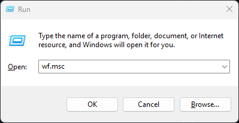

---

### Step 2: List Current Firewall Rules

Reviewed existing firewall rules to understand the current security configuration:

1. Navigated to **Inbound Rules** section
2. Observed pre-configured rules including:
   - Core Networking rules
   - Remote Desktop rules
   - File and Printer Sharing rules
   - Application-specific rules

**Purpose**: This step demonstrates awareness of existing firewall configurations before making changes.

**📸 Deliverable**: Screenshot of Inbound Rules listing

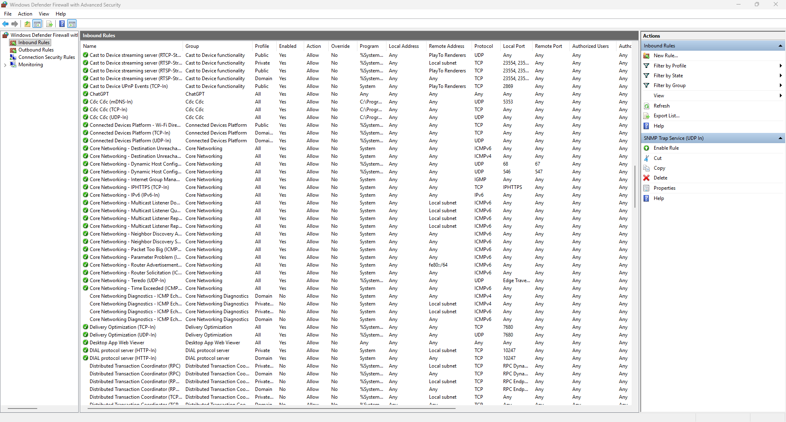

---

### Step 3: Create Rule to Block Port 23 (Telnet)

Created a custom inbound rule to block Telnet traffic on port 23:

**Configuration Details**:
- **Rule Type**: Port-based rule
- **Protocol**: TCP
- **Port**: 23 (Telnet)
- **Action**: Block the connection
- **Profile**: Applied to Domain, Private, and Public networks
- **Rule Name**: "Block Telnet Port 23"

**Steps Executed**:
1. Right-clicked on Inbound Rules → Selected "New Rule..."
2. Selected "Port" as rule type
3. Chose "TCP" protocol
4. Specified port `23`
5. Selected "Block the connection"
6. Applied to all network profiles
7. Named the rule "Block Telnet Port 23"

**Rationale**: Port 23 (Telnet) transmits data in plaintext and is inherently insecure. Blocking it prevents potential unauthorized access and eavesdropping.

**📸 Deliverable**: Screenshot of the created block rule

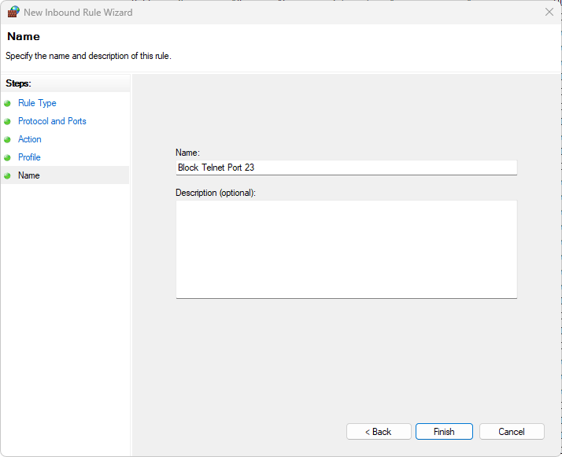

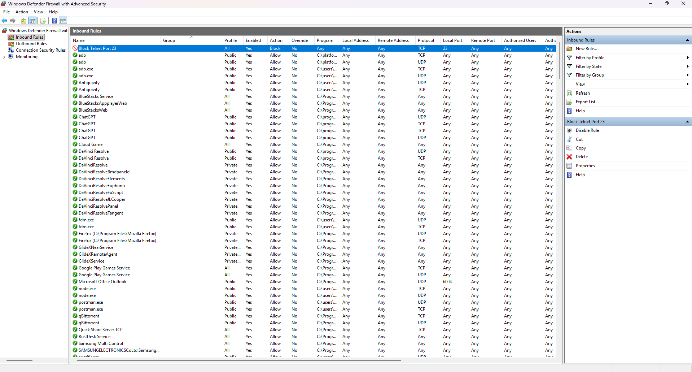

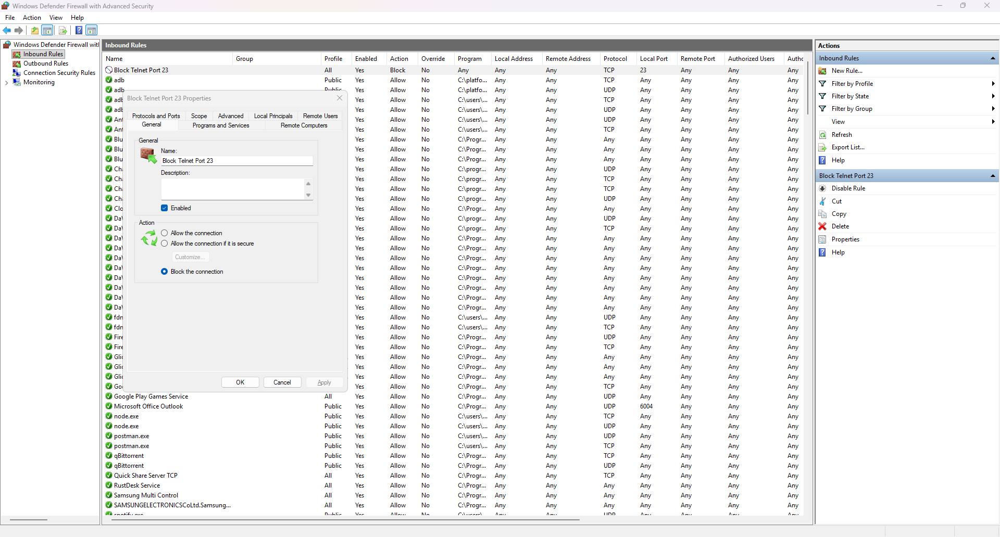

---

### Step 4: Test the Block Rule

Verified that the firewall rule effectively blocks Telnet connections:

**Test Method**:
1. Enabled Telnet Client via Windows Features
2. Opened Command Prompt
3. Executed: `telnet localhost 23`

**Expected Behavior**: Connection should fail or timeout

**Actual Result**: Connection was blocked by the firewall rule, confirming successful implementation.

**📸 Deliverable**: Screenshot of failed Telnet connection attempt (Locally Test and Test from Another Machine)

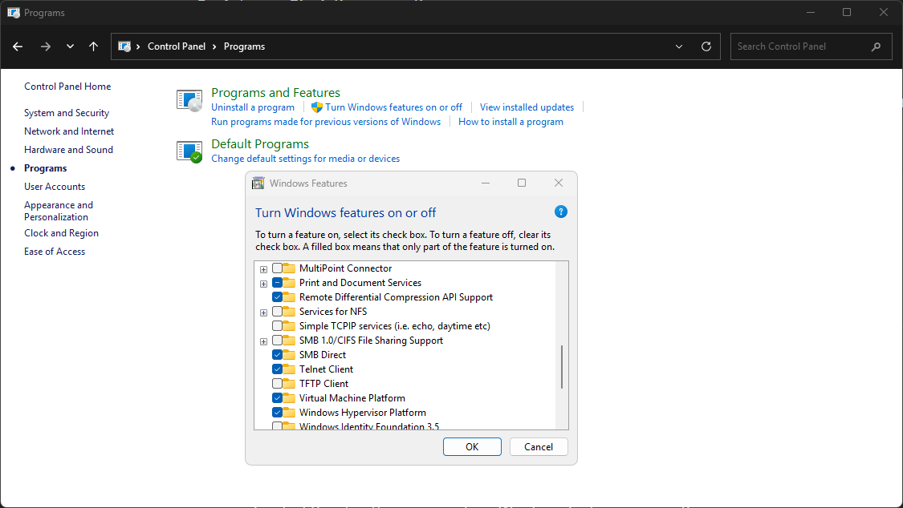

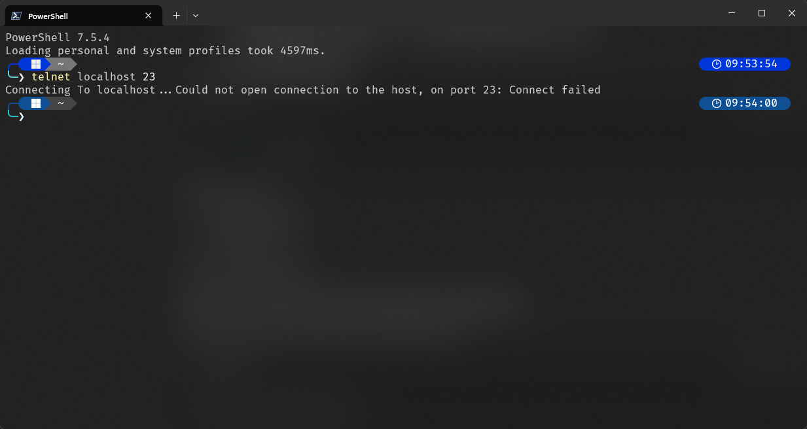

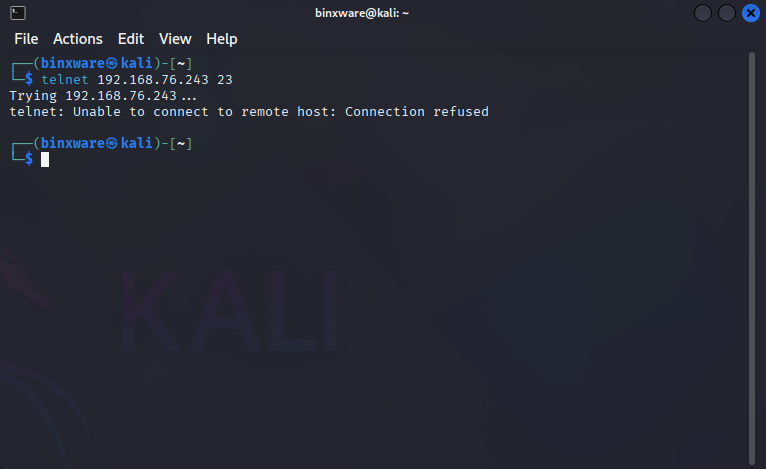

---

### Step 5: Verify ALLOW Rule (Remote Desktop)

Examined an existing ALLOW rule to demonstrate how the firewall permits legitimate traffic:

**Rule Examined**: Remote Desktop - User Mode (TCP-In)
- **Action**: Allow
- **Port**: 3389 (RDP)
- **Status**: Enabled

**Purpose**: This shows the contrast between blocking malicious/unnecessary traffic (Telnet) and allowing legitimate services (Remote Desktop).

**📸 Deliverable**: Screenshot of allow rule properties 

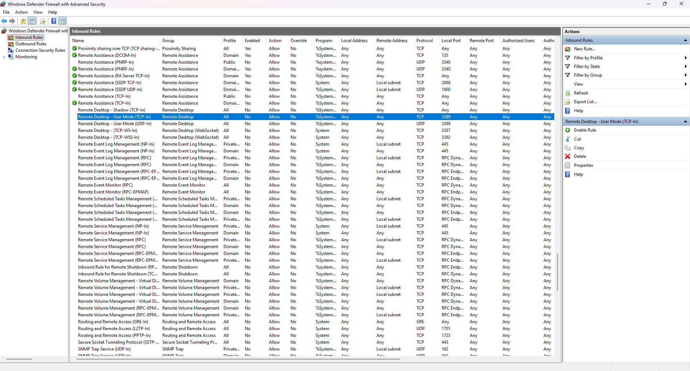

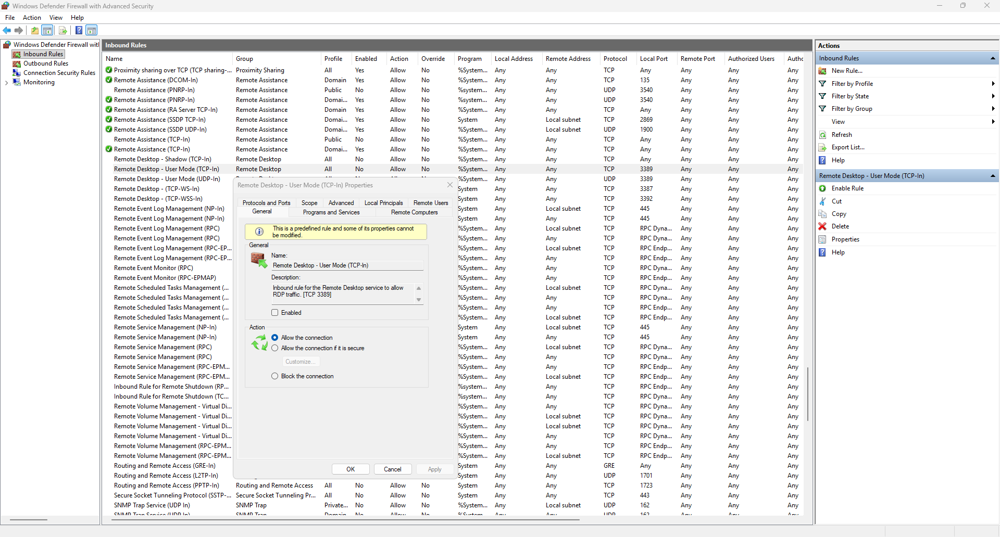

---

### Step 6: Remove Test Block Rule (Restore Original State)

Cleaned up the test environment by removing the custom block rule:

**Steps**:
1. Located "Block Telnet Port 23" rule in Inbound Rules
2. Right-clicked the rule → Selected "Delete"
3. Confirmed deletion

**Result**: Firewall configuration restored to original state.

**📸 Deliverable**: Screenshot showing rule has been removed

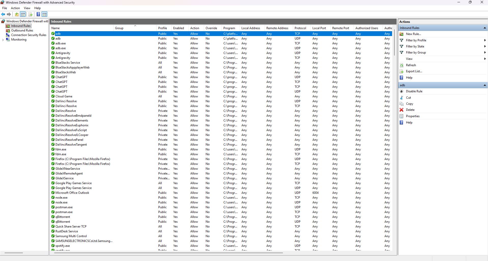

---

### Step 7: Export Firewall Policy (Optional)

Exported the complete firewall configuration for documentation purposes:

1. Right-clicked "Windows Defender Firewall with Advanced Security"
2. Selected "Export Policy..."
3. Saved as `firewall-policy.txt`

**📄 Deliverable**: Sample Firewall policy export file *(see: `firewall-policy.txt`)*

---

## How Firewall Filters Traffic

### Traffic Filtering Mechanism

A firewall acts as a barrier between trusted internal networks and untrusted external networks. Here's how it filters traffic:

#### 1. **Rule-Based Processing**
- Firewall evaluates incoming and outgoing packets against configured rules
- Rules are processed in order of priority
- First matching rule determines the action (Allow/Block)

#### 2. **Packet Inspection**
- **Source/Destination IP Address**: Identifies where traffic originates and where it's headed
- **Port Numbers**: Determines which service/application the traffic is targeting
- **Protocol Type**: Distinguishes between TCP, UDP, ICMP, etc.

#### 3. **Default Actions**
- **Inbound Traffic**: Typically blocked by default unless explicitly allowed
- **Outbound Traffic**: Usually allowed by default (can be restricted)

#### 4. **Stateful Inspection**
Windows Firewall uses stateful packet inspection:
- Tracks active connections
- Allows return traffic for established connections
- Blocks unsolicited inbound traffic

### Example from This Lab

**Blocking Port 23 (Telnet)**:
1. Packet arrives at port 23
2. Firewall checks inbound rules
3. Finds "Block Telnet Port 23" rule
4. Drops the packet without responding
5. Connection fails

**Allowing Port 3389 (RDP)**:
1. Packet arrives at port 3389
2. Firewall checks inbound rules
3. Finds "Remote Desktop - Allow" rule
4. Forwards packet to RDP service
5. Connection succeeds

---

## Key Learnings

### Technical Skills Gained
✅ Navigated Windows Firewall Advanced Security interface  
✅ Created custom port-based firewall rules  
✅ Tested firewall effectiveness using network tools  
✅ Understood difference between ALLOW and BLOCK actions  
✅ Documented and exported firewall configurations  

### Security Concepts Understood
- **Defense in Depth**: Firewall as first line of defense
- **Least Privilege**: Only allow necessary services
- **Port Security**: Blocking insecure protocols (Telnet)
- **Rule Management**: Importance of organized, documented rules

---

## Files in This Repository

```
Task 4
│
├── README.md                          # This file
├── firewall-policy.txt                # Exported firewall configuration
│
└── screenshots/
    ├── 01-inbound-rules-list.png      # Initial rules listing
    ├── 02-block-telnet-rule.png       # Created block rule
    ├── 03-telnet-blocked-test.png     # Failed connection test
    ├── 04-rdp-allow-rule.png          # Example allow rule
    └── 05-rule-removed.png            # Cleanup confirmation
```

---

## Commands Reference

### Windows Firewall Management

```powershell
# Open Firewall Console
wf.msc

# PowerShell Alternative - List all inbound rules
Get-NetFirewallRule -Direction Inbound | Select-Object DisplayName, Enabled, Action

# Create block rule via PowerShell
New-NetFirewallRule -DisplayName "Block Telnet Port 23" -Direction Inbound -Protocol TCP -LocalPort 23 -Action Block

# Remove rule via PowerShell
Remove-NetFirewallRule -DisplayName "Block Telnet Port 23"

# Test connection (after enabling Telnet Client)
telnet localhost 23
```

---

## Conclusion

This task successfully demonstrated fundamental firewall configuration and testing on Windows 11. The exercise reinforced understanding of:

- How firewalls control network traffic
- The importance of blocking insecure services
- Proper documentation and testing procedures
- Restoring systems to original state after testing

**Security Takeaway**: Properly configured firewalls are essential for protecting systems from unauthorized access. Always block unnecessary ports and services, and regularly audit firewall rules to maintain security posture.

---


