# Network Traffic Capture and Analysis Using Wireshark

## Objective
Capture live network packets on Kali Linux and identify basic protocols and traffic types using Wireshark.

## Environment
- **Operating System:** Kali Linux (Virtual Machine)
- **Tool:** Wireshark
- **Network Interface:** eth0 (primary VM adapter)
- **Capture Duration:** ~60 seconds

## Installation and Setup

### 1. Verify Wireshark Installation
```bash
wireshark --version
```

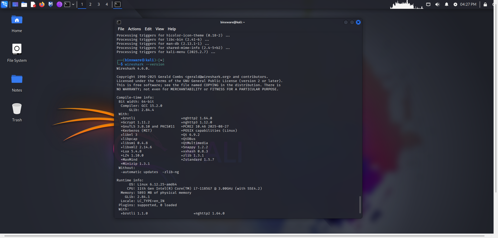


### 2. Install if Not Present
```bash
sudo apt update
sudo apt install wireshark -y
```

### 3. Configure User Permissions
```bash
sudo usermod -aG wireshark $USER
```
**Note:** Logout and login required for group changes to take effect.

### 4. Identify Active Network Interface
```bash
ip a
```
Look for the interface with an assigned IP address (typically `eth0` in VM environments).

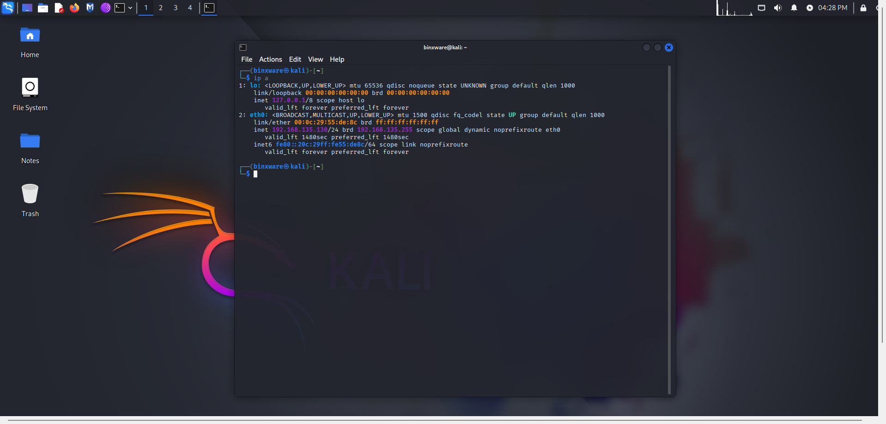

### 5. Start Packet Capture

Launch Wireshark:
```bash
wireshark
```

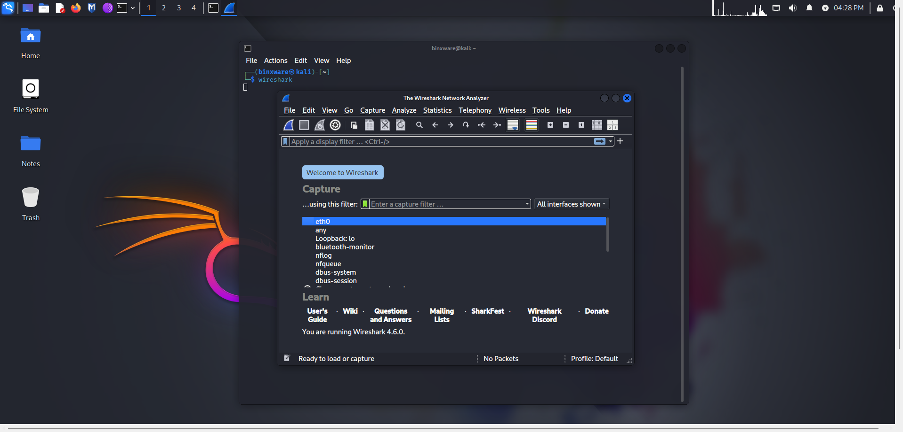

- Select your active interface (usually eth0)
- You should immediately see packets scrolling
- If you see nothing, you picked the wrong interface

### 6. Generate traffic intentionally
You need controlled traffic, not random background noise.
Do at least TWO of these:
- Option A: Ping
- Option B: Web browsing
Let traffic run for about 90 seconds.

### 7. Stop Capture
Click the red square stop button in Wireshark.
Do NOT let it run endlessly. Large noisy captures look lazy.

## Traffic Generation Methods

### ICMP Traffic
```bash
ping google.com -c 5
```


Generates echo request and reply packets.

### HTTP/HTTPS Traffic
- Opened Firefox browser in Kali Linux
- Visited `https://example.com` and `https://google.com`
- Generated DNS queries, TCP connections, and TLS traffic

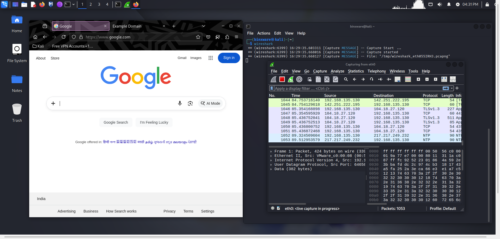

## Protocols Identified

### 1. **ICMP (Internet Control Message Protocol)**
- **Purpose:** Network diagnostics and reachability testing
- **Observed:** Echo (ping) request and reply packets
- **Filter Used:** `icmp`
- **Key Fields:** Type, Code, Identifier, Sequence Number

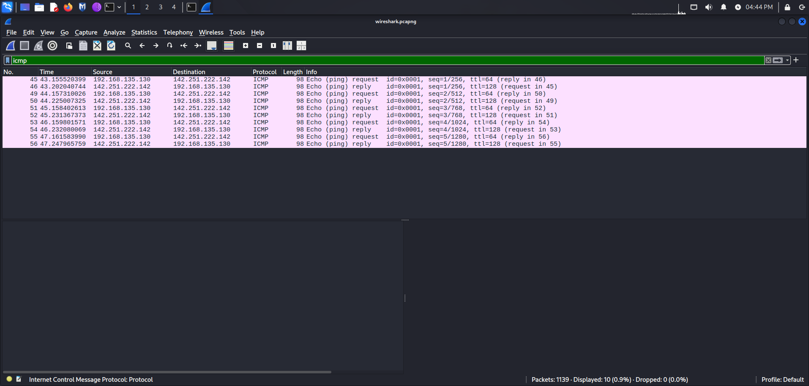

### 2. **DNS (Domain Name System)**
- **Purpose:** Resolves domain names to IP addresses
- **Observed:** Standard queries for visited websites
- **Filter Used:** `dns`
- **Key Fields:** Query Name, Query Type, Response IP

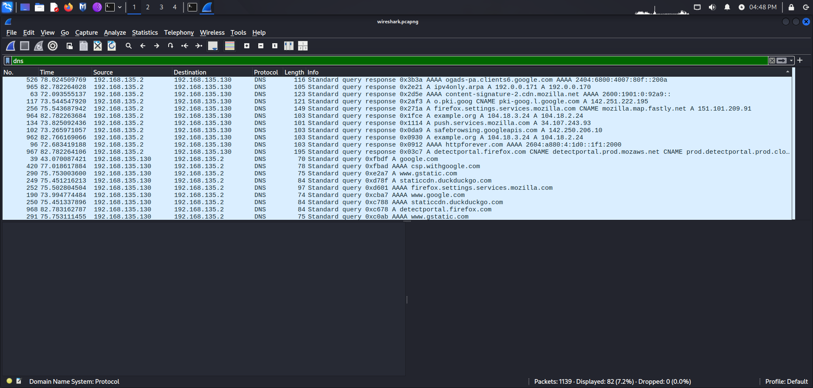

### 3. **TCP (Transmission Control Protocol)**
- **Purpose:** Reliable connection-oriented data transmission
- **Observed:** Three-way handshake (SYN, SYN-ACK, ACK)
- **Filter Used:** `tcp`
- **Key Fields:** Source Port, Destination Port, Sequence Number, Flags

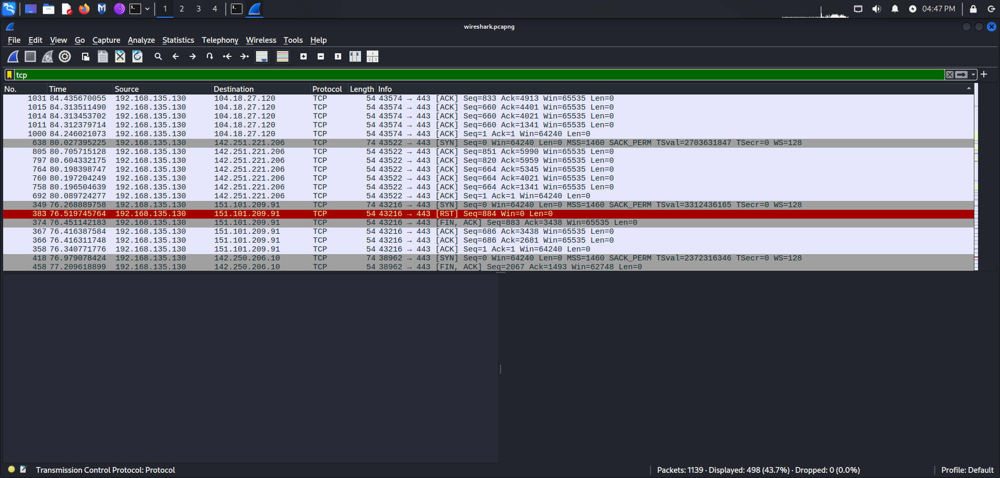

### 4. **TLS (Transport Layer Security)**
- **Purpose:** Encrypted web traffic
- **Observed:** Client Hello, Server Hello handshake packets
- **Filter Used:** `tls`
- **Key Fields:** Handshake Protocol, Cipher Suites

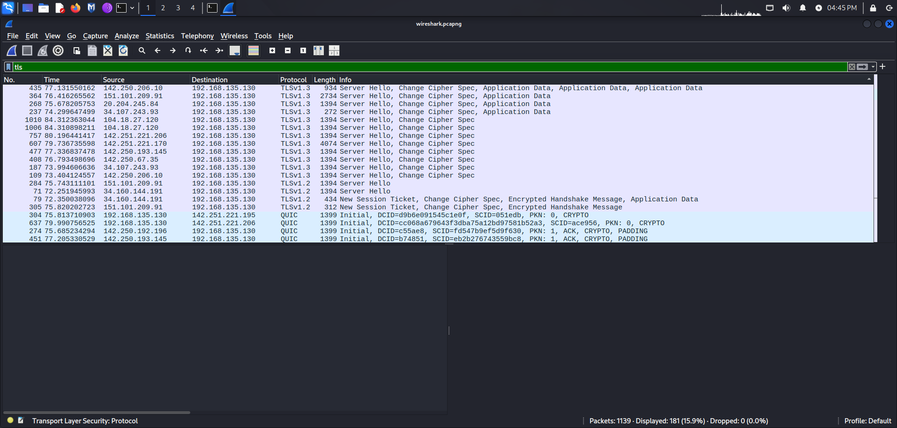

## Wireshark Filters Applied

| Protocol | Filter Command |
|----------|----------------|
| ICMP | `icmp` |
| DNS | `dns` |
| TCP | `tcp` |
| TLS | `tls` |
| HTTP | `http` |

## Analysis Highlights

### ICMP Analysis
- Echo request packets sent to `142.251.222.142` (Google DNS)
- TTL values observed: 64 (outgoing), 128 (incoming)
- Sequence numbers incremented per request
- Round-trip time measured in packet details

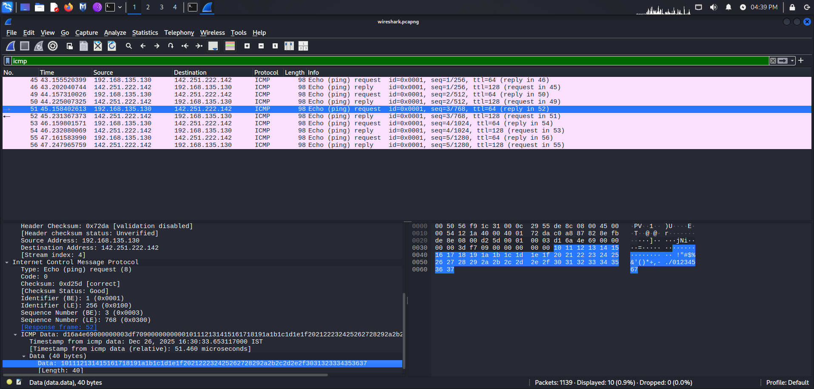

### TCP Analysis
- Observed complete three-way handshake
- Source ports: Dynamic high ports (>49152)
- Destination ports: 80 (HTTP), 443 (HTTPS)
- Window size and acknowledgment numbers tracked
- TCP flags: SYN, ACK, PSH, FIN observed


### DNS Analysis
- Standard queries for domain name resolution
- Query type A (IPv4 address records)
- Response times measured
- Multiple DNS servers observed in traffic

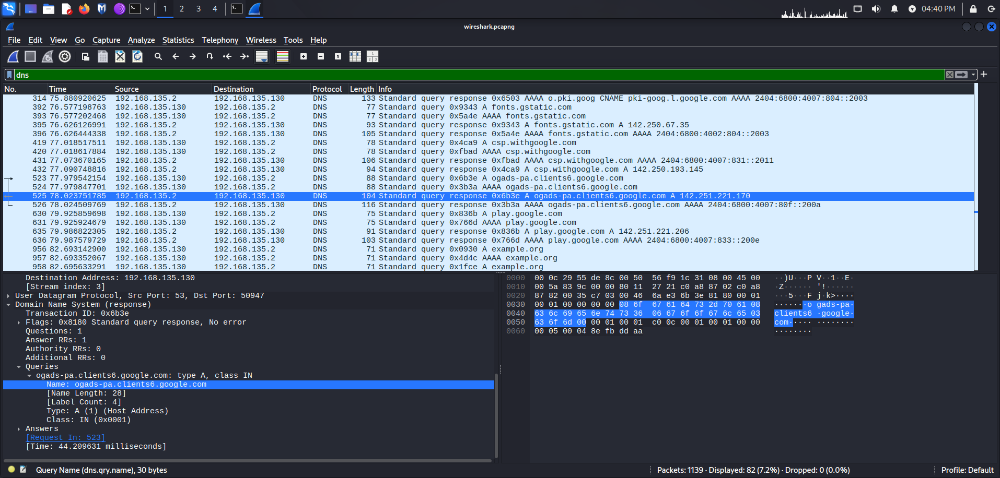

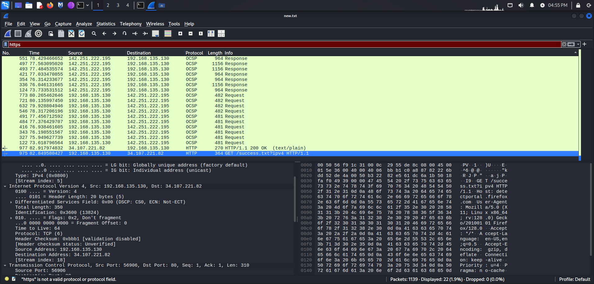

## Packet Capture Details

**File Information:**
- **Filename:** `kali_network_capture.pcap`
- **Total Packets Captured:** 1139 packets
- **Capture Duration:** ~90 seconds
- **Capture Filter:** None (captured all traffic on eth0)
- **File Size:** ~600 KB

## Key Observations

1. **Protocol Distribution:** TCP dominated the capture due to web browsing activity
2. **Encrypted Traffic:** Most HTTP traffic now uses TLS (HTTPS)
3. **Background Noise:** Observed system-level DNS queries and TCP keepalives
4. **Packet Structure:** Successfully identified headers, payloads, and protocol-specific fields

## Skills Demonstrated

- Live packet capture on active network interface
- Protocol identification and classification
- Wireshark display filter application
- Packet-level inspection and field analysis
- Traffic pattern recognition
- Export and documentation of capture files

## Deliverables

✅ Packet capture file (`.pcap` format)  
✅ Protocol identification (minimum 3 protocols)  
✅ Wireshark screenshots showing filtered traffic  
✅ Analysis report with findings  

## Tools Used

- **Wireshark:** Network protocol analyzer
- **Kali Linux:** Penetration testing distribution
- **Firefox:** Web traffic generation
- **ping utility:** ICMP traffic generation

## Conclusion

This exercise demonstrated fundamental packet analysis skills using Wireshark on Kali Linux. Successfully captured and analyzed multiple network protocols including ICMP, DNS, TCP, and TLS. The analysis provided visibility into network communication at the packet level, revealing protocol behavior, connection establishment, and data transmission patterns.

Understanding packet-level traffic is essential for network troubleshooting, security analysis, and protocol debugging.

## Repository Structure

```
Task 5
│
├── README.md
├── kali_network_capture.pcapng
├── screenshots/
│          
└── analysis_report.pdf
```

## Learning Outcomes

- Hands-on experience with industry-standard packet analysis tool
- Understanding of common network protocols
- Ability to filter and interpret network traffic
- Foundation for advanced network security analysis

---
