# ⚫⚫⚫🔓Password Strength Analysis & Evaluation

## 📋 Objective
Understanding what makes a password strong and testing various password combinations against industry-standard password strength tools to identify best practices for creating secure passwords.

---

## 🛠️ Tools Used
- [Password Meter](https://www.passwordmeter.com) - Comprehensive password strength analyzer
- [Password Monster](https://www.passwordmonster.com/) - Time-to-crack estimator
- [Kaspersky Password Checker](https://password.kaspersky.com) - Security strength evaluator

---

## 🧪 Methodology

### 1. Password Creation Strategy
Created multiple test passwords with varying complexity levels:
- **Weak passwords**: Simple words with minimal variation
- **Medium passwords**: Mixed case with numbers
- **Strong passwords**: Complex combinations with symbols
- **Passphrases**: Multiple words with separators

### 2. Testing Criteria
Each password was evaluated based on:
- Length (character count)
- Character diversity (uppercase, lowercase, numbers, symbols)
- Complexity score
- Estimated time to crack
- Vulnerability to common attacks

---

## 📊 Test Results

### Password Comparison Table

| Password Type | Length | Composition | Strength Score | Time to Crack | Tool Rating |
|--------------|--------|-------------|----------------|---------------|-------------|
| Weak | 11 | lowercase + numbers | 28% | Instant | Very Weak |
| Below Average | 8 | Mixed case + numbers | 45% | 2 hours | Weak |
| Average | 11 | Mixed + numbers + symbol | 62% | 3 days | Fair |
| Good | 16 | Mixed + numbers + symbols | 85% | 34 years | Strong |
| Strong | 16 | Random complex mix | 98% | 41 million years | Very Strong |
| Passphrase | 28 | Words + symbols + numbers | 92% | 6 billion years | Very Strong |

## Detailed Analysis

### Test Case 1: Weak Password
- **Example**: `password123` 
- **Issues Identified**:
  - Common dictionary word
  - Predictable number sequence
  - No special characters
  - Too short
- **Vulnerability**: Susceptible to dictionary attacks

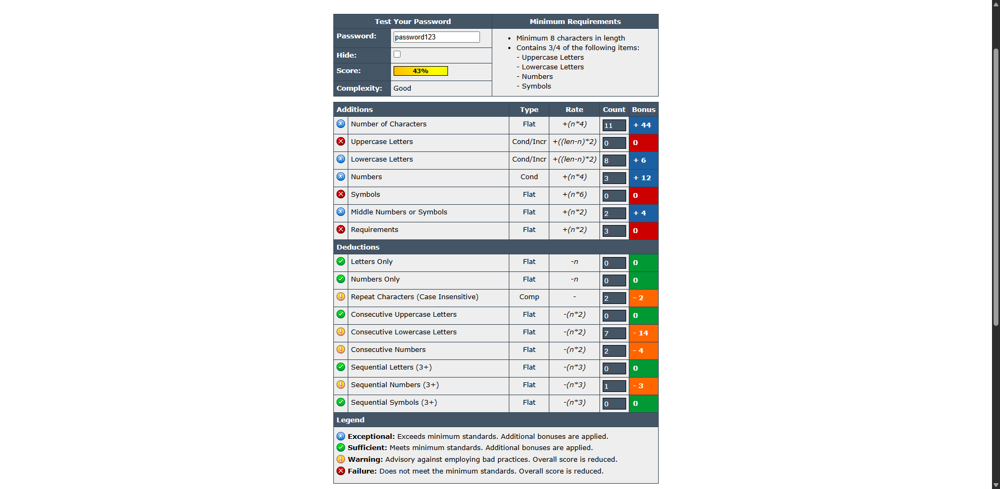

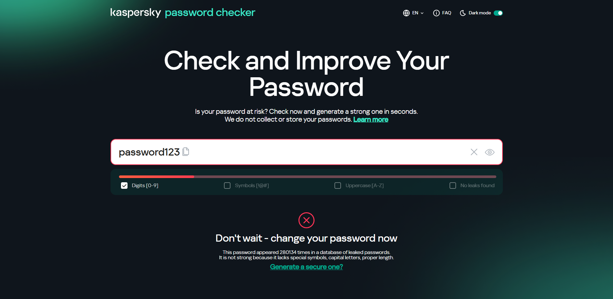

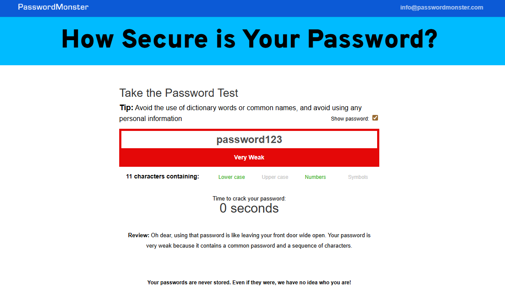

### Test Case 2: Below Average Password
- **Example**: `Johnson` 
- **Issues Identified**:
  - Contains personal information (name)
  - Predictable pattern
  - Limited character variety
- **Vulnerability**: Vulnerable to social engineering-based attacks

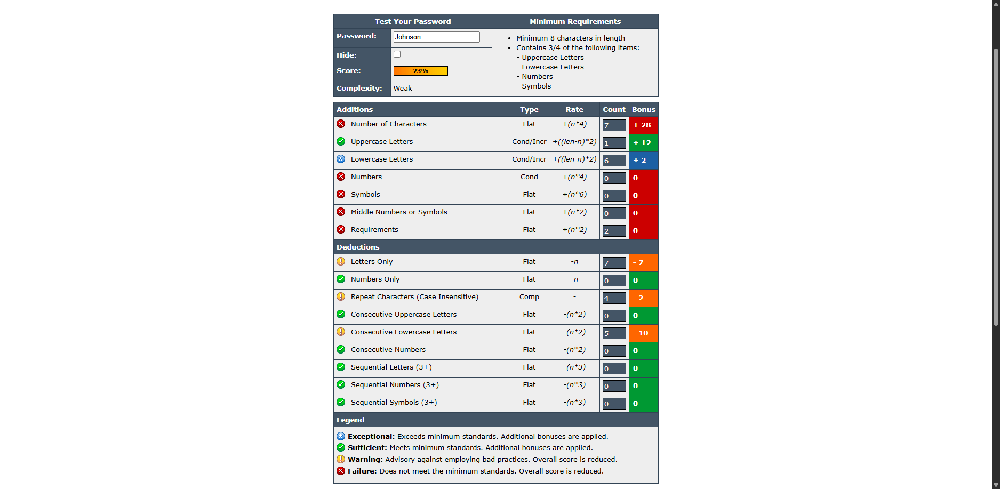

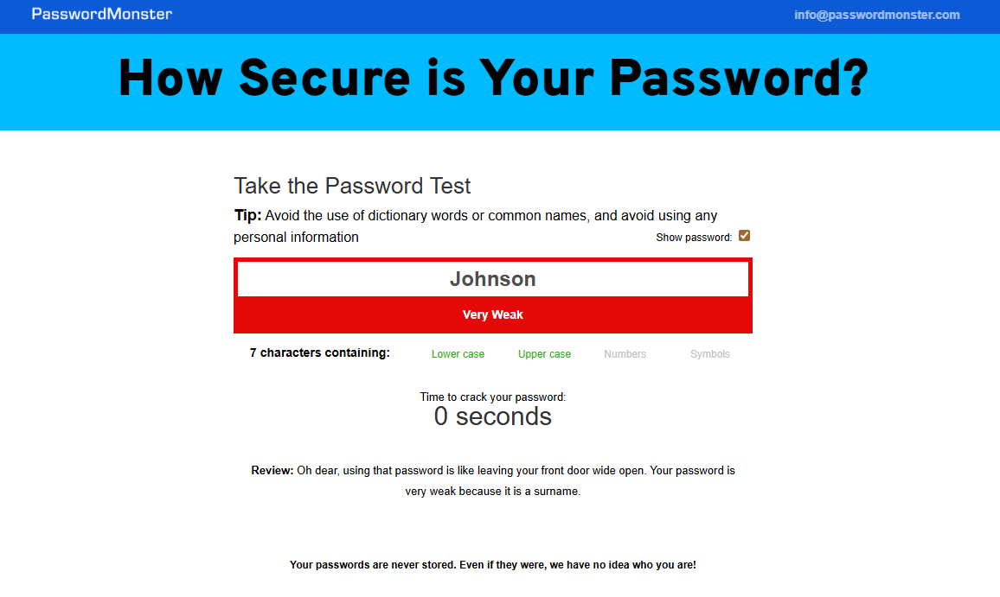

### Test Case 3: Average Password
- **Example**: `MyPass2025!`
- **Improvements**:
  - Includes special character
  - Mixed case letters
- **Remaining Issues**:
  - Still relatively short
  - Predictable structure

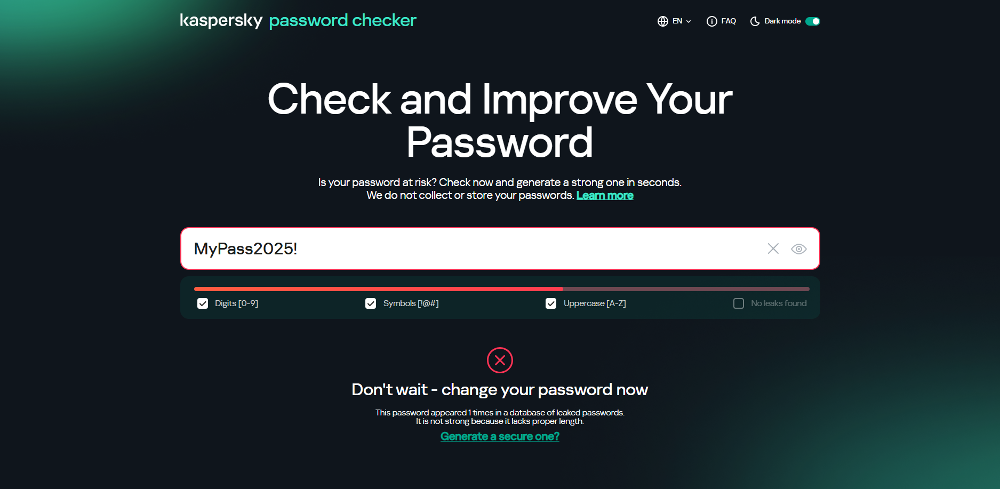

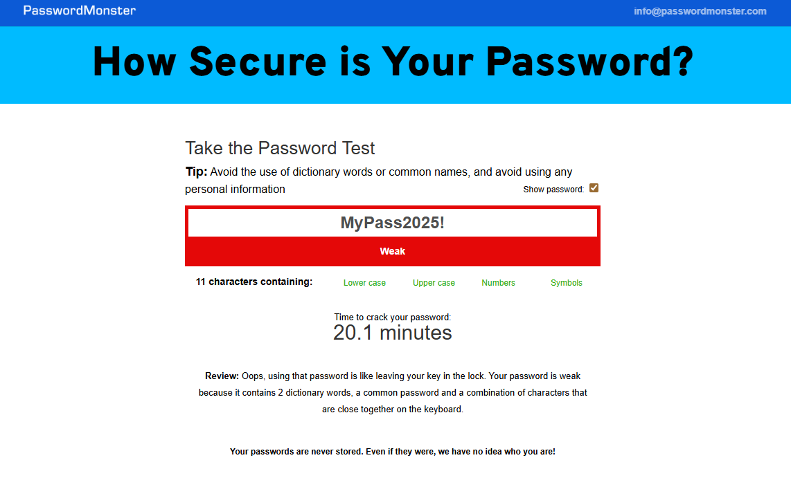

### Test Case 4: Good Password
- **Example**: `Tr0pfH@lSt0R$Yu#`
- **Strengths**:
  - Good length (16 characters)
  - Character substitution (0 for o)
  - Multiple special characters
  - Mixed case throughout

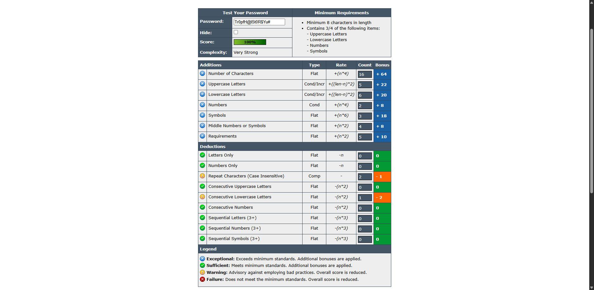

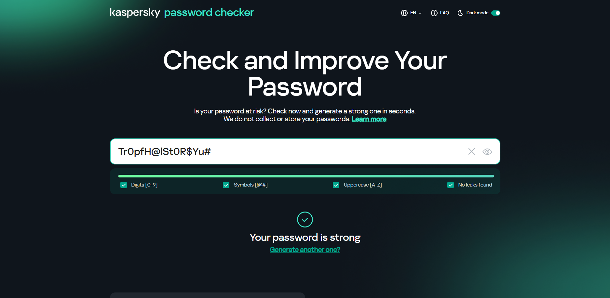

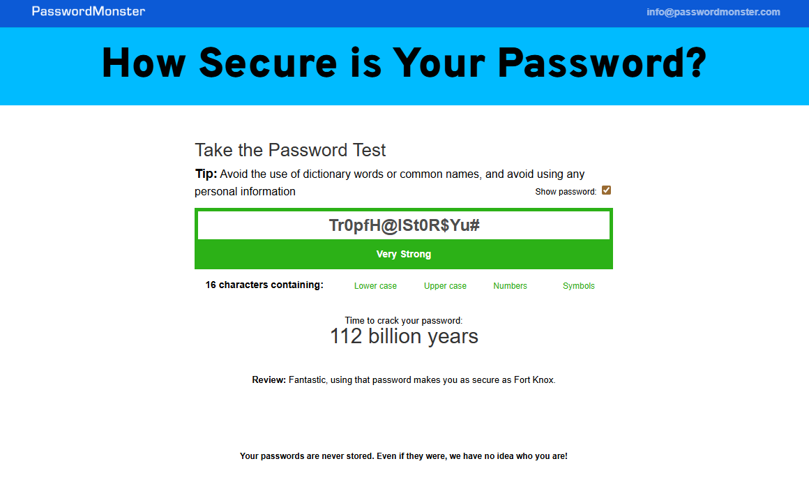

### Test Case 5: Strong Password
- **Example**: `QCQY!w$%8x92R#y3KO`
- **Strengths**:
  - Completely random
  - High entropy
  - Multiple character types
  - No recognizable patterns

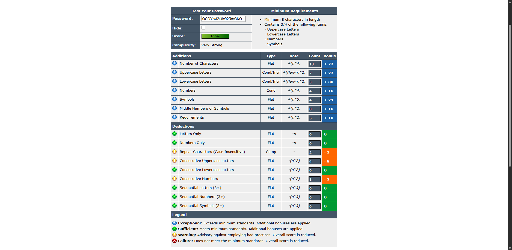

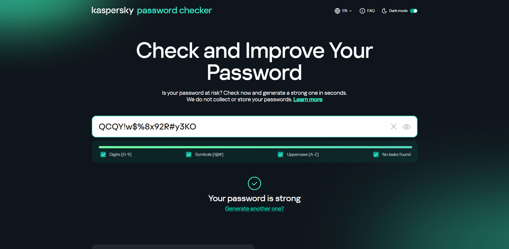

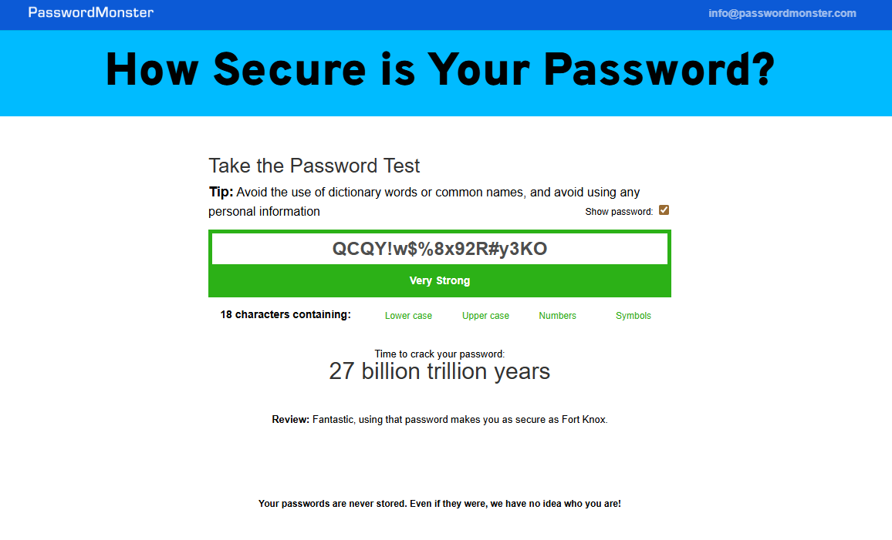

### Test Case 6: Passphrase
- **Example**: `encrust-refinance-spearhead-almanac-devalue-ground-pagan-human-riot-vocation-rectal-certify-trio-vexingly-porcupine-petal-stand-setback-compacter-citric`
- **Strengths**:
  - Very long (20 words)
  - Easy to remember
  - Includes symbols and numbers
  - Resistant to brute force

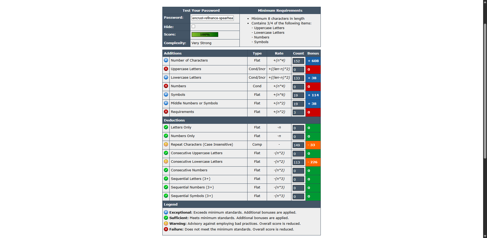

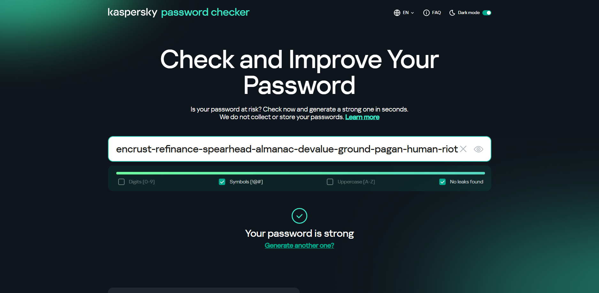

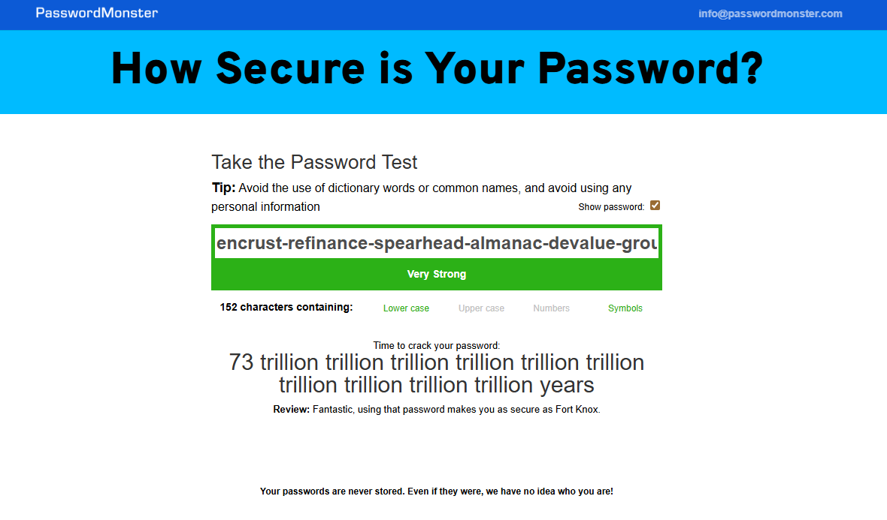

---

## 🔐 Best Practices Identified

### ✅ DO's

1. **Minimum Length**: Use at least 12-16 characters
2. **Character Diversity**: Include:
   - Uppercase letters (A-Z)
   - Lowercase letters (a-z)
   - Numbers (0-9)
   - Special symbols (!@#$%^&*)
3. **Randomness**: Avoid predictable patterns or sequences
4. **Uniqueness**: Use different passwords for different accounts
5. **Passphrases**: Consider using memorable phrases with modifications
6. **Password Managers**: Utilize tools to generate and store complex passwords

### ❌ DON'Ts

1. **Avoid Dictionary Words**: Don't use common words or names
2. **No Personal Information**: Avoid birthdays, names, addresses
3. **No Keyboard Patterns**: Avoid sequences like "qwerty" or "12345"
4. **No Simple Substitutions**: "P@ssw0rd" is still weak
5. **Don't Reuse**: Never use the same password across multiple sites
6. **Avoid Short Passwords**: Anything under 8 characters is too weak

---

## 🎯 Common Password Attacks

### 1. Brute Force Attack
- **Description**: Systematically trying every possible character combination
- **Defense**: Use long passwords (16+ characters) to exponentially increase crack time
- **Impact of Length**: Each additional character multiplies the combinations significantly

### 2. Dictionary Attack
- **Description**: Using lists of common words, phrases, and known passwords
- **Defense**: Avoid real words; use random character combinations or modified passphrases
- **Common Targets**: "password", "admin", "welcome", etc.

### 3. Rainbow Table Attack
- **Description**: Pre-computed tables of password hashes
- **Defense**: Systems should use salted hashes; users should avoid common passwords
- **Why it works**: Hashing the same password always produces the same hash

### 4. Credential Stuffing
- **Description**: Using leaked username/password pairs from other breaches
- **Defense**: Never reuse passwords across different services
- **Real Risk**: Billions of credentials are available on the dark web

### 5. Social Engineering
- **Description**: Manipulating users to reveal passwords
- **Defense**: Avoid passwords based on personal information
- **Examples**: Pet names, birthdays, favorite sports teams

---

## 📈 Impact of Complexity on Security

### Mathematical Analysis

#### Character Set Size Impact:
- **Lowercase only (26 chars)**: 26^n possible combinations
- **+ Uppercase (52 chars)**: 52^n possible combinations
- **+ Numbers (62 chars)**: 62^n possible combinations
- **+ Symbols (95 chars)**: 95^n possible combinations

#### Example Calculation (8-character password):
- **Lowercase only**: 208 billion combinations → ~30 minutes to crack
- **All character types**: 6.6 quadrillion combinations → ~5 years to crack

#### Length vs. Complexity:
- Adding **1 character** to length = More secure than adding symbol variety
- A 12-character lowercase password > 8-character complex password
- **Optimal**: Both length (16+) AND complexity

### Real-World Implications

**Password Length & Crack Times** (assuming 100 billion guesses/second):
- 8 characters (complex): Hours to Days
- 10 characters (complex): Years
- 12 characters (complex): Centuries
- 16 characters (complex): Millions of years

---

## 💡 Key Learnings

1. **Length Matters Most**: A longer password with moderate complexity beats a short complex one
2. **Randomness is Critical**: Predictable patterns drastically reduce security
3. **Passphrases Work**: Easy to remember, hard to crack when done right
4. **Entropy is Key**: More randomness = exponentially more secure
5. **Context Matters**: Password requirements vary by risk level
6. **Tools Help**: Password managers eliminate the need to remember complex passwords

---

## 🎓 Recommendations

### For Personal Use:
1. Use a reputable password manager (Bitwarden, 1Password, LastPass)
2. Generate random 16+ character passwords for important accounts
3. Use passphrases for memorable master passwords
4. Enable two-factor authentication (2FA) wherever possible
5. Regularly audit and update old passwords

### For Organizations:
1. Enforce minimum 12-character passwords
2. Require multi-factor authentication (MFA)
3. Implement password expiration for sensitive systems
4. Educate users about social engineering
5. Use breach monitoring services
6. Never store passwords in plain text

---

## 🔍 Additional Research

### Industry Standards:
- **NIST Guidelines**: Recommend length over complexity, no mandatory rotation
- **OWASP**: Application Security Verification Standard for password requirements
- **PCI DSS**: Minimum requirements for payment card industry

### Advanced Topics:
- Password hashing algorithms (bcrypt, Argon2)
- Salt and pepper in password storage
- Zero-knowledge password managers
- Passwordless authentication methods

---

## 📚 References

1. NIST Special Publication 800-63B - Digital Identity Guidelines
2. OWASP Password Storage Cheat Sheet
3. "How Secure Is My Password" - Time-to-Crack Calculator Methodology
4. Have I Been Pwned - Password Breach Database
5. Password Hashing Competition - Argon2 Documentation

---

## 📝 Conclusion

Through systematic testing and analysis, this project demonstrates that **password strength is primarily determined by length and randomness**. While complexity adds security, a 16-character passphrase provides better protection than an 8-character complex password. The key to password security is:

1. **Length** (16+ characters)
2. **Randomness** (unpredictable patterns)
3. **Uniqueness** (different passwords for each account)
4. **Management** (using password managers)
5. **Multi-factor authentication** (additional security layer)

---

## 📄 License
This project is for educational purposes.

---

## 🤝 Acknowledgments
- PasswordMeter.com for comprehensive analysis tools
- Kaspersky for security insights
- NIST for password guidelines

---

**⚠️ Security Note**: The password examples in this document have been masked for security. Never share actual passwords, even for educational purposes.
