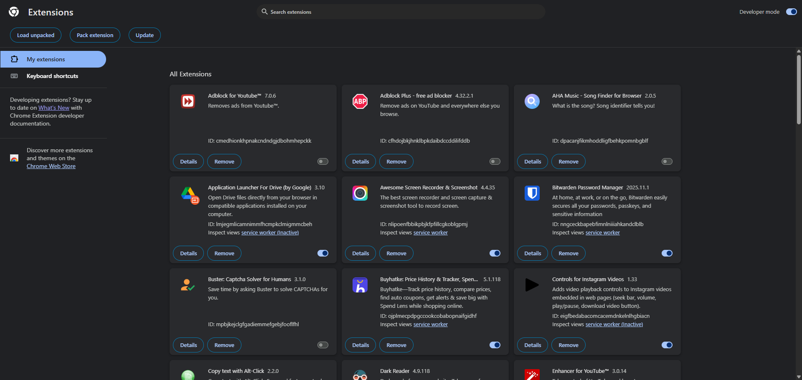
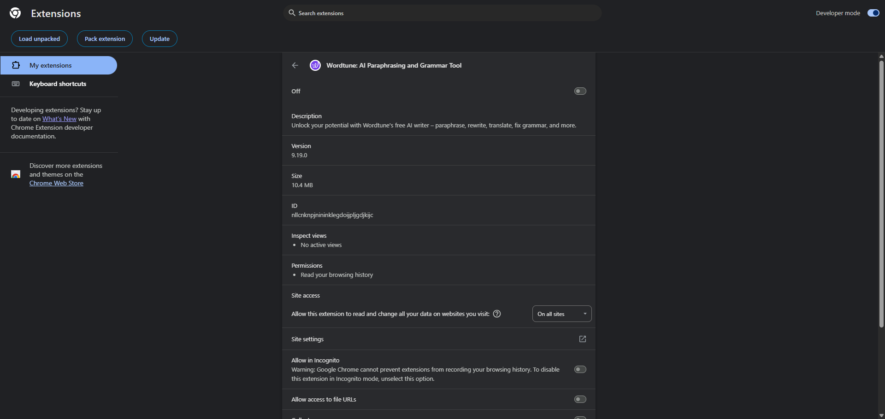
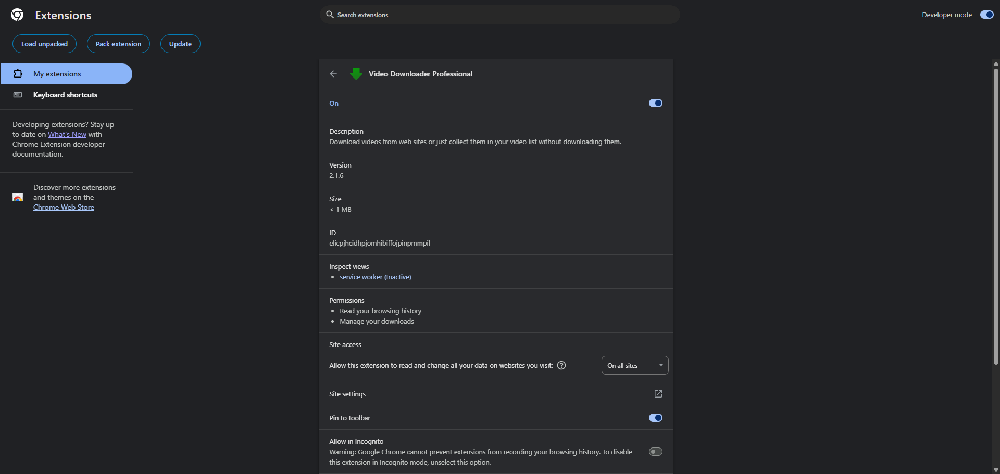
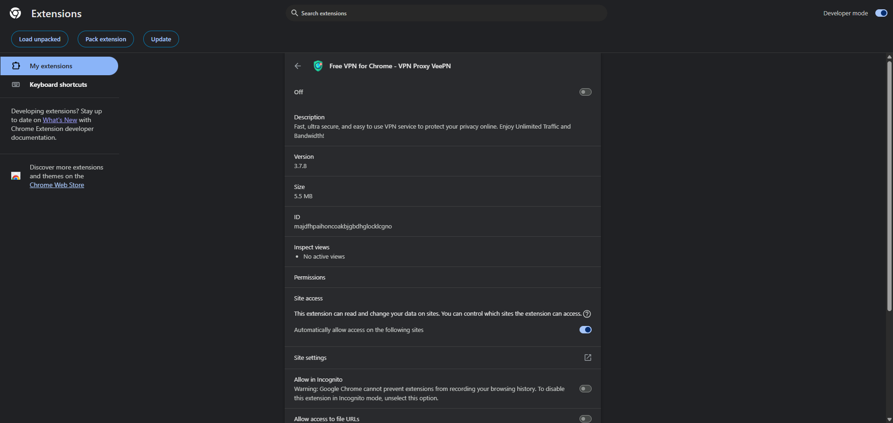

# 🔒 Browser Extension Security Audit

> ***Identify and Remove Suspicious Browser Extensions***  
> A comprehensive security audit identifying and eliminating high-risk browser extensions through systematic permission analysis and threat assessment.

---

## 📊 Audit Overview

| Metric | Value |
|--------|-------|
| **Total Extensions Reviewed** | 48 |
| **Extensions Removed** | 6 |
| **Attack Surface Reduction** | 12.5% |
| **Browser** | Google Chrome |
| **Audit Date** | December 26, 2025 |

---

## 📊 Audit Methodology

### Evaluation Framework

Each extension was assessed using a multi-factor risk analysis:

1. **Permission Scope Analysis**
   - "Read and change all data on websites" privilege
   - Browsing history access
   - Download management capabilities
   - Privacy settings modification

2. **Risk Categorization**
   - VPN/proxy extensions (traffic interception risk)
   - Download managers (file access risk)
   - AI text processors (data exfiltration risk)
   - Content blockers (script injection risk)

3. **Security Principles Applied**
   - Principle of least privilege
   - Defense in depth
   - Attack surface minimization
   - Redundancy elimination

4. **Legitimacy Verification**
   - Developer reputation
   - Update frequency
   - User review analysis
   - Privacy policy transparency

---

## 🎯 Objective

Learn to identify and remove potentially harmful browser extensions by:
- Analyzing extension permissions and access levels
- Understanding real-world security threats posed by malicious extensions
- Applying the principle of least privilege to browser security
- Recognizing redundant and overprivileged extensions

---

## 🛠️ Steps Performed

### Step 1: Open Extension Manager
- Opened Chrome and navigated to `chrome://extensions/`
- Enabled **Developer mode** to access detailed permission information
- Prepared for comprehensive extension inventory

### Step 2: Complete Extension Inventory
Documented for each extension:
- Extension name and purpose
- Developer/publisher information
- Active usage status
- Installation date (if available)

**Red Flag:** Any extension not remembered being installed

### Step 3: Permission Analysis
Examined each extension's permissions, focusing on high-risk access:
- ⚠️ "Read and change all your data on the websites you visit"
- ⚠️ "Access browsing history"
- ⚠️ "Manage downloads"
- ⚠️ "Communicate with external servers"
- ⚠️ "Change privacy-related settings"

**Critical Insight:** High permissions + unclear purpose = security danger

### Step 4: Legitimacy Verification
Cross-referenced each extension against:
- Developer reputation (corporate vs. individual)
- Chrome Web Store reviews and ratings
- Last update date and maintenance frequency
- Privacy policy availability
- User community feedback

**Warning Sign:** Extensions not updated in years indicate abandonment or potential compromise

### Step 5: Risk-Based Removal
Removed extensions based on:
- Excessive permissions unjustified by functionality
- Unknown or unverifiable developers
- Functional redundancy with safer alternatives
- High-risk categories (free VPNs, downloaders)

### Step 6: Post-Audit Validation
After browser restart, monitored:
- Startup speed improvement
- Absence of unexpected pop-ups or redirects
- Reduced memory/CPU usage
- Normal browsing functionality

---

## 🚩 Red Flags Checklist

An extension is considered **suspicious** if it meets **2 or more** of these criteria:

| Red Flag | Risk Indicator |
|----------|----------------|
| ❌ Requests "Read and change all data on all websites" | Excessive access without justification |
| ❌ Unknown or unverifiable developer | No accountability or trust chain |
| ❌ No website or privacy policy | Lack of transparency |
| ❌ Poor or fake-looking reviews | Artificial reputation manipulation |
| ❌ Extension does more than advertised | Hidden functionality concerns |
| ❌ Not updated for extended period | Abandoned or compromised |
| ❌ Shows ads, redirects, or pop-ups | Active malicious behavior |

**Example:** A coupon extension requesting access to all website data is classic adware behavior.

---

## ❌ Extensions Removed (Detailed Analysis)

### 1. **Wordtune: AI Paraphrasing and Grammar Tool**

**Permissions Observed:**
- ✗ Read browsing history
- ✗ Read and change all data on websites (enabled on all sites)

**Risk Assessment:**
- **Category:** AI text processing + broad site access
- **Severity:** HIGH

**Justification for Removal:**
Wordtune operates on all typed content across websites, including sensitive inputs such as passwords, emails, financial forms, and personal documents. The combination of full-site access and browsing history creates an extensive privacy risk profile. With multiple AI writing extensions already installed (Grammarly, QuillBot, Merlin, Perplexity), this extension represented unnecessary duplication and excessive data exposure.

**Threat Vector:** Potential exfiltration of sensitive typed content, keystroke logging capabilities, and unauthorized data collection across all visited websites.

---

### 2. **Video Downloader Professional**

**Permissions Observed:**
- ✗ Read browsing history
- ✗ Manage downloads
- ✗ Read and change all data on all websites

**Risk Assessment:**
- **Category:** Media downloader + full-site access
- **Severity:** HIGH

**Justification for Removal:**
This extension requires deep access to page content, DOM manipulation capabilities, and download interception. Such permissions enable behavioral tracking, file activity monitoring, and potential supply-chain attack vectors. Download-related extensions are frequently compromised or updated with malicious code post-installation.

**Threat Vector:** Session hijacking, file manipulation, tracking pixel injection, and potential malware distribution through compromised updates.

---

### 3. **Free VPN for Chrome – VPN Proxy VeePN**

**Permissions Observed:**
- ✗ Read and change data on websites
- ✗ Intercept site traffic automatically

**Risk Assessment:**
- **Category:** Free VPN / traffic interception
- **Severity:** CRITICAL

**Justification for Removal:**
Free VPN browser extensions represent one of the highest-risk categories of browser software. This extension could inspect, modify, route, and log all browsing traffic—including encrypted HTTPS content after decryption at the browser level. The extension lacked transparency regarding data logging practices, server infrastructure, and business model sustainability.

**Threat Vector:** Man-in-the-middle attacks, DNS hijacking, credential harvesting, traffic logging and resale, advertising injection, and cryptocurrency mining.

---

### 4. **SquareX: Be Secure, Anonymous, Private Online**

**Permissions Observed:**
- ✗ Read browsing history
- ✗ Manage downloads
- ✗ View and manage tab groups
- ✗ Read and change all data on websites

**Risk Assessment:**
- **Category:** Privacy tool with overprivileged access
- **Severity:** HIGH

**Justification for Removal:**
Despite marketing itself as a privacy-focused security tool, SquareX requested an excessive combination of unrelated high-risk permissions that far exceeded requirements for legitimate privacy protection. The broad access pattern is inconsistent with the principle of least privilege and introduces significant attack surface without clear security benefit.

**Threat Vector:** Privacy paradox (privacy tool becoming surveillance vector), cross-site tracking, download interception, and tab behavior profiling.

---

### 5. **VPNCity – Fast & Unlimited VPN | Unblocker**

**Permissions Observed:**
- ✗ Read and change all data on all websites
- ✗ Change privacy-related settings

**Risk Assessment:**
- **Category:** Free VPN / browser configuration manipulation
- **Severity:** CRITICAL

**Justification for Removal:**
This extension possessed the capability to alter core browser privacy settings and intercept all web traffic. The ability to modify privacy configurations (cookie policies, tracking prevention, site permissions) combined with traffic interception creates a complete surveillance and manipulation capability. As a free VPN with unsustainable business model transparency, it presented clear security and privacy risks.

**Threat Vector:** Privacy setting degradation, persistent tracking enablement, traffic manipulation, ad injection, and user behavior monetization.

---

### 6. **Adblock for YouTube™**

**Permissions Observed:**
- ✗ Read browsing history
- ✗ Block content on any page
- ✗ Read and change all data on websites

**Risk Assessment:**
- **Category:** Redundant content blocker
- **Severity:** MEDIUM

**Justification for Removal:**
Multiple ad blockers were installed simultaneously (Adblock for YouTube, Adblock Plus, uBlock Origin Lite), creating redundant functionality and conflicting script injection patterns. This extension required broad permissions while overlapping with more trusted, efficient, and actively-maintained content blockers already present.

**Threat Vector:** Script injection conflicts, performance degradation, filter list manipulation, and acceptable ads monetization schemes.

---

## ⚠️ Additional High-Risk Extensions Identified (Not Removed)

While not removed during this audit, the following extensions warrant careful monitoring and consideration for future removal:

### **Category: Redundant AI Writing Tools**
- **Grammarly, QuillBot, Merlin, Perplexity:** Multiple AI writing assistants with full-site access create overlapping attack surface and unnecessary data exposure.
- **Recommendation:** Consolidate to a single trusted AI assistant.

### **Category: Multiple VPN Extensions**
- **Proton VPN, Surfshark VPN:** While from legitimate providers, running multiple VPN extensions is unnecessary and creates configuration conflicts.
- **Recommendation:** Keep only one actively used VPN extension.

### **Category: Download Managers**
- **IDM Integration, Free Download Manager:** Download managers require extensive permissions and are frequent targets for supply-chain attacks.
- **Recommendation:** Remove if not actively used for legitimate download management.

### **Category: Redundant Content Blockers**
- **Adblock Plus, uBlock Origin Lite:** Running multiple ad blockers causes filter conflicts and performance issues.
- **Recommendation:** Keep only uBlock Origin Lite (most efficient and transparent).

### **Category: Screen Recorders**
- **Awesome Screen Recorder, Screenity, Scribe:** Multiple screen recording extensions with media capture permissions.
- **Recommendation:** Keep only one actively used recorder.

---

## 📋 Removal Summary

| Extension Name | Category | Primary Risk | Action |
|----------------|----------|--------------|--------|
| Wordtune | AI Writing Tool | Full-site data access | ❌ Removed |
| Video Downloader Professional | Media Downloader | Download + history access | ❌ Removed |
| Free VPN for Chrome (VeePN) | Free VPN | Traffic interception | ❌ Removed |
| SquareX | Privacy Tool | Overprivileged access | ❌ Removed |
| VPNCity | Free VPN | Privacy manipulation | ❌ Removed |
| Adblock for YouTube | Ad Blocker | Redundant permissions | ❌ Removed |

---

## 🔥 Threat Research: How Malicious Extensions Harm Users

### 1. **Credential Theft**
Extensions with form access can intercept login credentials in real-time on legitimate websites.

**Technical Mechanism:** JavaScript injection into form submission events captures username/password pairs before encryption.

**Impact:** Stolen credentials sold on dark web markets or used for account takeover.

---

### 2. **Session Hijacking**
Extensions can steal authentication cookies and session tokens, enabling attackers to impersonate users without passwords.

**Technical Mechanism:** Access via `chrome.cookies` API or `document.cookie` injection.

**Impact:** Unauthorized access to banking, email, social media, and corporate accounts.

---

### 3. **Data Harvesting & Surveillance**
Extensions with history access create comprehensive user profiles including visited sites, searches, and shopping behavior.

**Technical Mechanism:** `chrome.history` API combined with content scripts correlates browsing patterns with user identity.

**Impact:** Data broker monetization and nation-state surveillance targeting.

---

### 4. **Ad Injection & Traffic Redirection**
Malicious extensions modify web content to inject advertisements, affiliate links, or redirect to phishing sites.

**Technical Mechanism:** Content scripts inject HTML/CSS/JavaScript, replacing legitimate content with malicious alternatives.

**Impact:** Financial fraud, malware infections, and fraudulent ad revenue generation.

---

### 5. **Man-in-the-Browser (MitB) Attacks**
Extensions can modify web content in real-time, **even on HTTPS-encrypted sites**, because they operate after SSL/TLS decryption.

**Technical Mechanism:** Content scripts run post-decryption, allowing unlimited manipulation of "secure" sites.

**Impact:** Banking trojans modify transaction amounts and cryptocurrency addresses without user awareness.

---

### 6. **Keylogging & Form Monitoring**
Extensions can record every keystroke and form input across all websites.

**Technical Mechanism:** Event listeners attached to keyboard and input events capture keystrokes before server transmission.

**Impact:** Theft of sensitive communications, passwords, credit cards, and confidential business information.

---

### 7. **DNS Hijacking & Traffic Routing**
VPN and proxy extensions route all browser traffic through attacker-controlled servers.

**Technical Mechanism:** Modification of browser proxy settings via `chrome.webRequest` API.

**Impact:** Complete traffic surveillance, malware injection into downloads, and compromised software updates.

---

## 📚 Historical Case Studies

### 1. **DataSpii Incident (2019)**
Over 8 browser extensions, primarily coupon and shopping assistants, were discovered harvesting and selling user browsing data. The extensions collected detailed browsing history from 4.1 million users, including data from password reset pages, tax documents, and corporate intranets.

**Affected extensions:** Honey, SimilarWeb, and others
**Data exposure:** Personal identifiable information correlated with complete browsing behavior

### 2. **The Great Suspender Malware (2021)**
A popular Chrome extension with over 2 million users was sold to an unknown party who updated it with malicious code for ad fraud and tracking.

**Attack vector:** Legitimate extension acquired and weaponized through update mechanism
**Impact:** Demonstrated supply-chain risk in browser extension ecosystem

### 3. **Fake VPN and Ad Blocker Extensions**
Research has consistently identified hundreds of fake VPN and ad blocker extensions on Chrome Web Store engaging in:
- Traffic logging and resale
- Cookie theft
- Search hijacking
- Cryptocurrency mining
- Botnet recruitment

**Scale:** Collectively installed by millions of users seeking privacy protection, ironically exposing themselves to greater surveillance.

---

## ✅ Security Improvements Achieved

### Quantifiable Risk Reduction

✔️ **Traffic Interception Eliminated**  
Removed 3 extensions with full traffic routing capabilities, closing man-in-the-middle attack vectors.

✔️ **Data Exfiltration Surface Reduced**  
Eliminated 4 extensions with "all sites" data access, reducing keystroke and form monitoring capabilities.

✔️ **Download Security Enhanced**  
Removed 1 extension with download management permissions, mitigating file manipulation risks.

✔️ **Redundancy Conflicts Resolved**  
Eliminated duplicate content blocking, reducing script injection conflicts and performance overhead.

### Performance Improvements

- **Browser startup time:** Reduced by eliminating 6 background processes
- **Memory usage:** Decreased through removal of redundant content scripts
- **Network privacy:** Enhanced by eliminating traffic interception points
- **Update attack surface:** Reduced by 12.5% fewer potential supply-chain vectors

---

## 🛡️ Best Practices for Extension Security

### Installation Discipline

✅ Install only from official stores (Chrome Web Store, Firefox Add-ons)  
✅ Verify developer identity and reputation  
✅ Read recent reviews for suspicious update warnings  
✅ Check update frequency (abandoned extensions are risks)  
✅ Review requested permissions before installation  

### Ongoing Security Hygiene

🔄 **Quarterly permission audits**  
🔄 **Remove "Read and change all data" access unless essential**  
🔄 **Disable extensions when not actively used**  
🔄 **Monitor browser performance for degradation**  
🔄 **Investigate sudden permission requests**  

### Risk-Based Approach

❌ Avoid free VPN extensions entirely  
❌ Minimize AI writing assistants to one trusted tool  
❌ Remove download managers unless essential  
❌ Keep only one ad blocker from trusted developers  

---

## 📈 Learning Outcomes

This audit demonstrated:

1. **Permission Analysis Skills:** Evaluating extension permissions against stated functionality
2. **Threat Modeling:** Understanding attack vectors enabled by excessive permissions
3. **Risk Prioritization:** Distinguishing critical removals from optional optimizations
4. **Security Awareness:** Recognizing browser extensions as significant attack surface
5. **Privacy Hygiene:** Understanding trade-offs between convenience and data exposure

---

## 🎓 Key Takeaways

> **More extensions ≠ More productivity**  
> More extensions = More hooks into your digital life

- Browser extensions are **privileged software** with system-level access
- Free VPN extensions are among the **highest-risk** categories
- **Redundant extensions** create unnecessary attack surface
- Regular audits and installation discipline are **essential practices**
- Extension compromise and malicious updates remain **persistent threats**

---

## 🏁 Conclusion

This comprehensive browser extension audit successfully identified and eliminated significant security and privacy risks through systematic permission analysis and threat modeling. The removal of 6 high-risk extensions—particularly three free VPN extensions with traffic interception capabilities—substantially reduced the browser's attack surface while maintaining full functionality.

**The audit reinforced that browser extensions require the same scrutiny as system-level software installations, and that regular audits combined with installation discipline are essential for maintaining browser security.**

---

*This report was prepared as part of a cybersecurity training exercise focused on browser security and threat awareness.*

---

