# 🌐🔑VPN Setup and Privacy Analysis

## Objective
Understanding the role of VPNs in protecting privacy and secure communication through hands-on implementation and analysis.

---

## Table of Contents
- [Introduction](#introduction)
- [VPN Setup Process](#vpn-setup-process)
- [Connection Verification](#connection-verification)
- [VPN Encryption and Privacy Features](#vpn-encryption-and-privacy-features)
- [Performance Analysis](#performance-analysis)
- [VPN Benefits and Limitations](#vpn-benefits-and-limitations)
- [Conclusion](#conclusion)

---

## Introduction

A Virtual Private Network (VPN) is a security tool that creates an encrypted tunnel between your device and the internet. It masks your IP address and encrypts your data, providing privacy and security when browsing online. This report documents the setup and analysis of ProtonVPN on Windows 11, along with an exploration of advanced privacy features available in premium VPN services like Surfshark.

---

## VPN Setup Process

### Step 1: Choosing a VPN Service

For this task, I selected **ProtonVPN** for the following reasons:
- Reputable company based in Switzerland (strong privacy laws)
- No-logs policy
- Free tier available with unlimited bandwidth
- Open-source applications
- Strong encryption standards

Other Free Alternatives: Windscribe, TunnelBear, Hide.me, TurboVPN, etc

Browser-extension VPN only protects traffic inside that one browser. Everything else on your PC leaks your real IP like nothing exists.

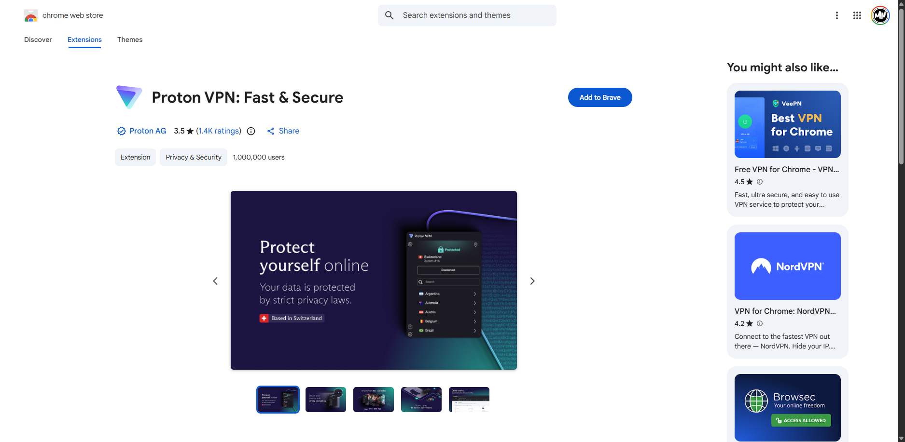

VPN software tunnels all system traffic. Every app, every socket, full device-level protection.

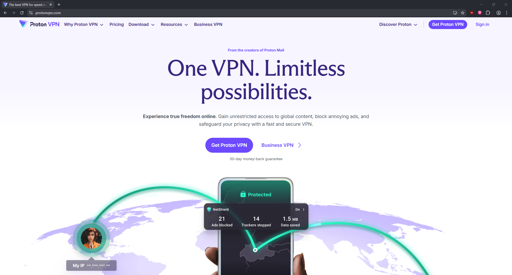

### Step 2: Account Registration

1. Visited [protonvpn.com](https://protonvpn.com)
2. Created a free account using email verification
3. Received confirmation email and activated account

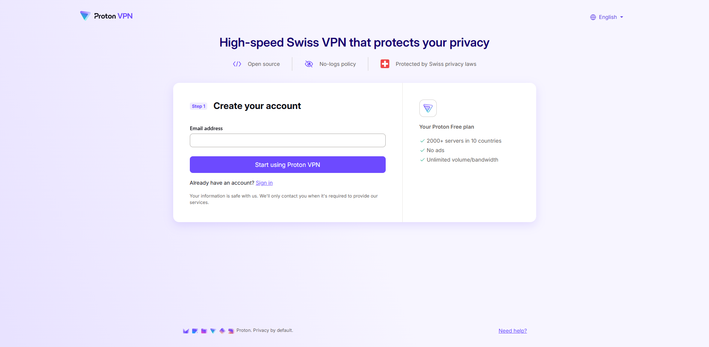

### Step 3: Client Download and Installation

1. Downloaded ProtonVPN client for Windows 11 from the official website
2. Run the installer with administrator privileges
3. Completed installation wizard with default settings
4. Launched ProtonVPN application

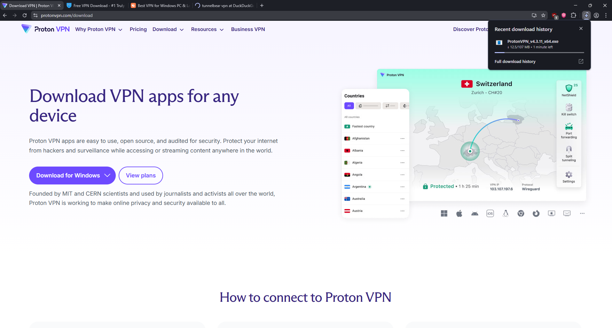

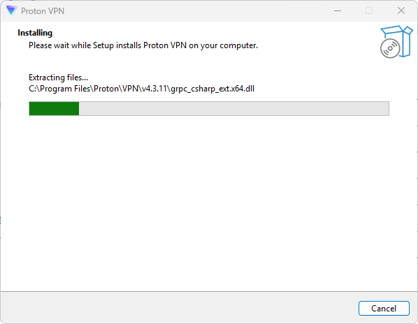

### Step 4: Client Configuration

1. Logged into the ProtonVPN client with credentials
2. Reviewed connection settings:
   - Protocol: WireGuard (default, recommended for speed)
   - Kill Switch: Enabled (prevents IP leaks if VPN disconnects)
   - Auto-connect: Disabled (manual control preferred)

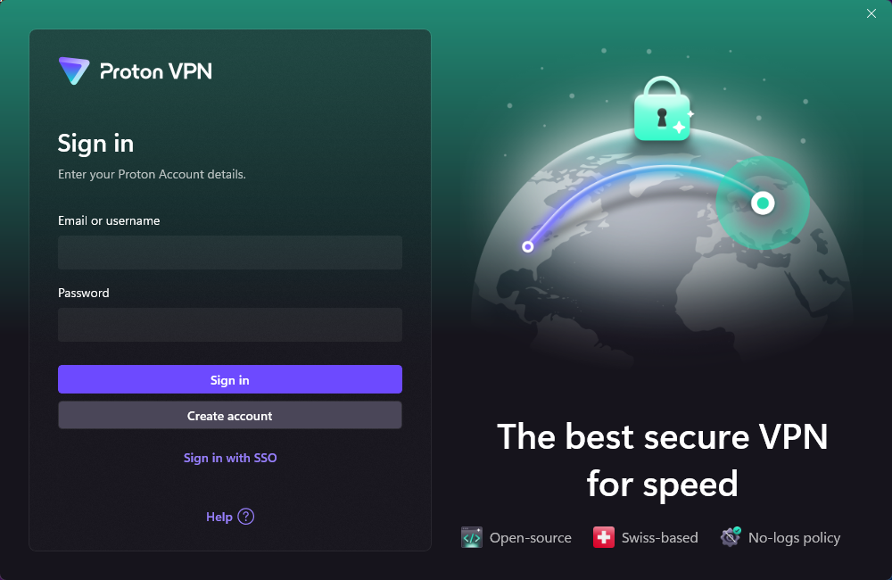

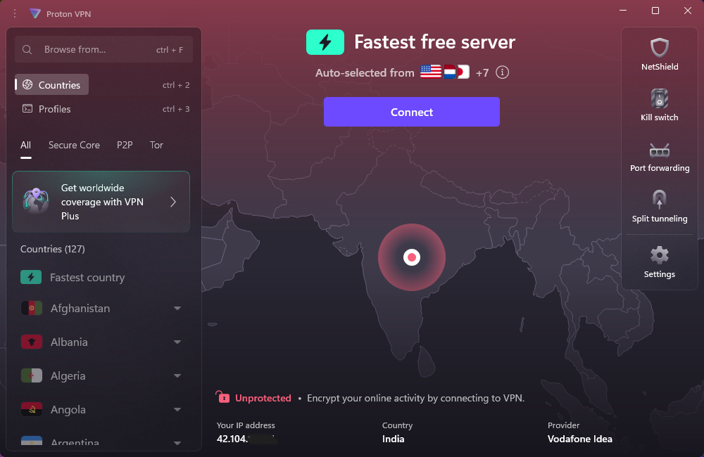

---

## Connection Verification

### Step 5: Establishing VPN Connection

1. Selected a VPN server from the available locations
   - Free tier provides servers in: US, Netherlands, Japan
2. Clicked "Connect" button
3. Connection established within 5-10 seconds
4. Green indicator showed active VPN connection

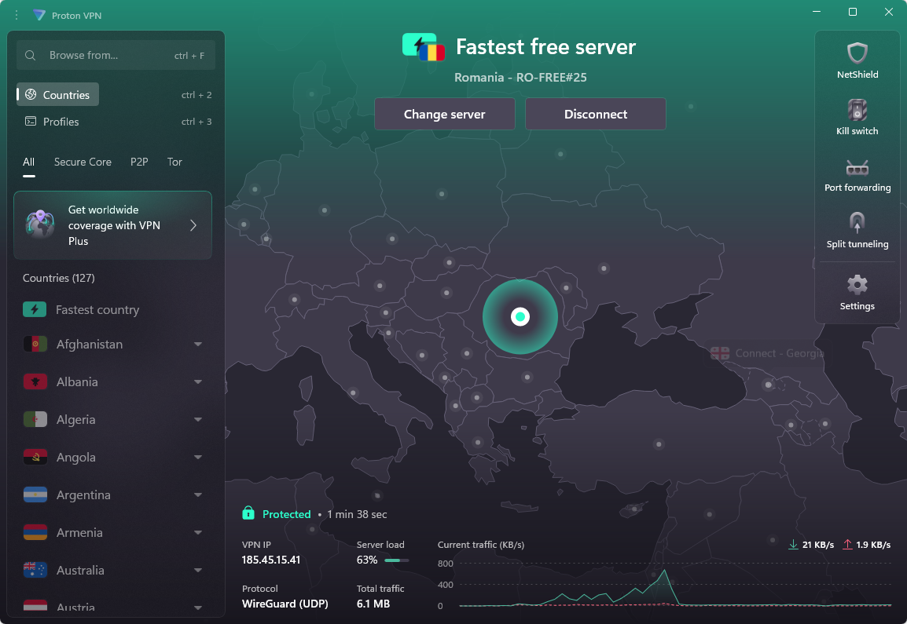

### Step 6: IP Address Verification

#### Before VPN Connection:
1. Visited [whatismyipaddress.com](https://whatismyipaddress.com)
2. Original IP details recorded:
   - **IP Address:** 42.104.XX.XXX
   - **Location:** India
   - **ISP:** Vodofone Idea

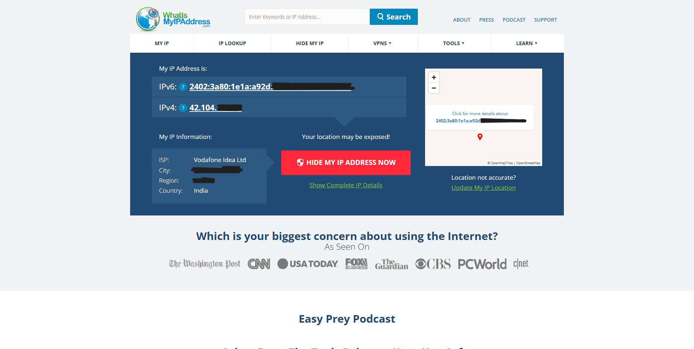

#### After VPN Connection:
1. Refreshed whatismyipaddress.com while connected to VPN
2. New IP details:
   - **IP Address:** 185.45.15.41
   - **Location:** Romania
   - **ISP:** M247 Europe SRL

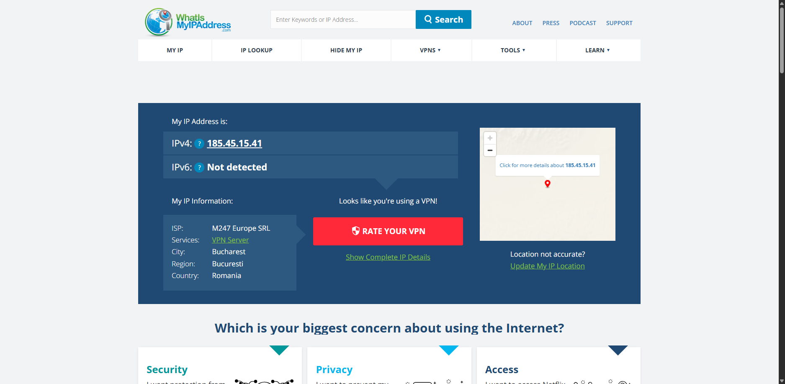

**Verification Result:** ✅ IP address successfully masked and changed to VPN server location.

### Step 7: Traffic Encryption Verification

1. Visited multiple websites to confirm encrypted traffic:
   - Banking website (HTTPS)
   - Social media platforms
   - Search engines
2. Used browser developer tools (F12) to verify:
   - All traffic routed through VPN tunnel
   - DNS requests handled by VPN DNS servers
   - No DNS leaks detected

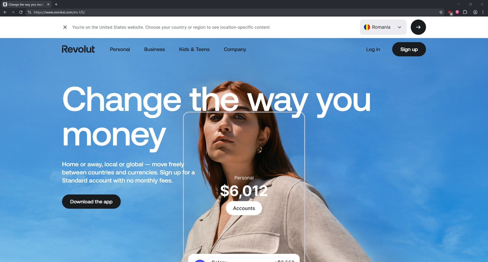

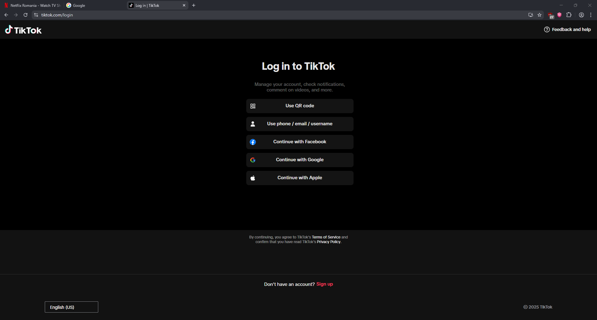

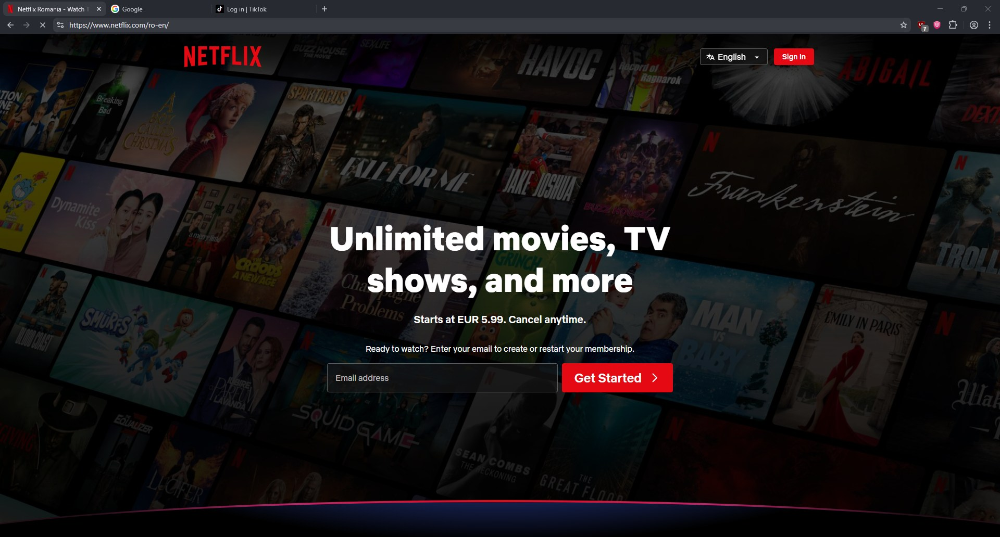

---

## VPN Encryption and Privacy Features

### ProtonVPN Encryption Standards

#### Encryption Protocols:
- **WireGuard:** Modern, fast protocol with ChaCha20 encryption
- **OpenVPN:** Industry standard with AES-256 encryption
- **IKEv2/IPSec:** Alternative protocol for mobile devices

#### Security Features:
1. **AES-256 Encryption:** Military-grade encryption standard
2. **Perfect Forward Secrecy:** New encryption keys for each session
3. **Secure Core:** Routes traffic through privacy-friendly countries (paid feature)
4. **Kill Switch:** Blocks internet if VPN disconnects
5. **No-Logs Policy:** No browsing history or connection logs stored
6. **DNS Leak Protection:** Prevents DNS queries from bypassing VPN

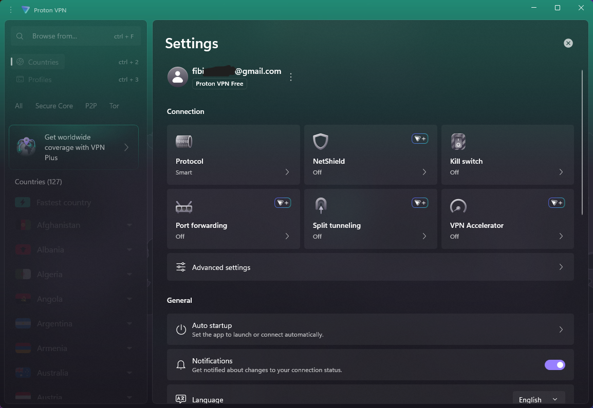

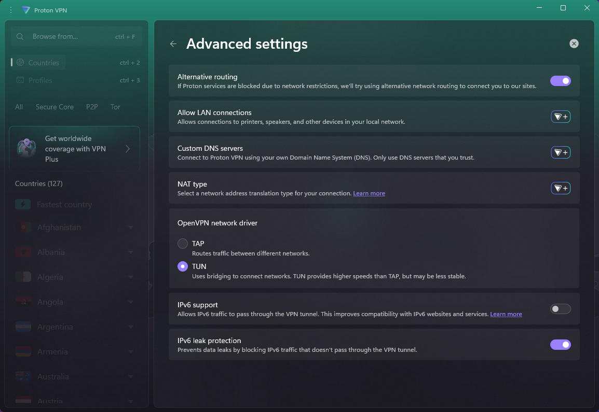

### Surfshark Premium Privacy Features

In addition to ProtonVPN, I have access to **Surfshark VPN** which offers advanced privacy tools.

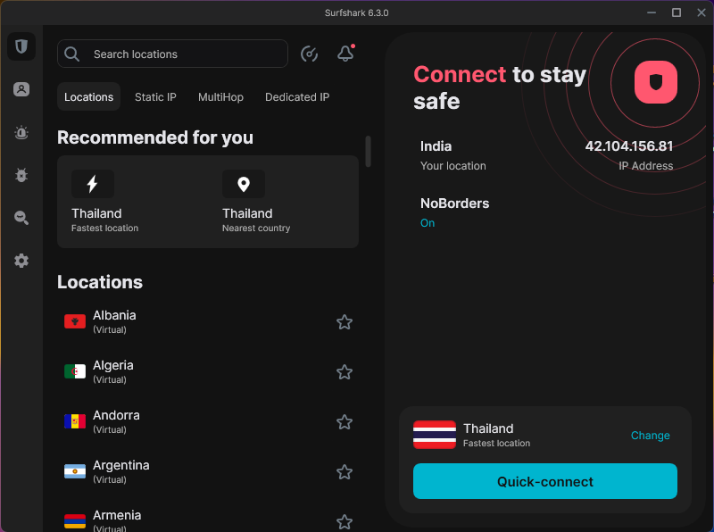

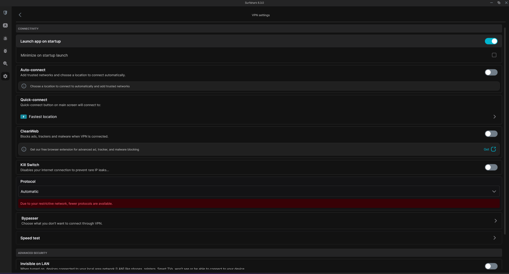

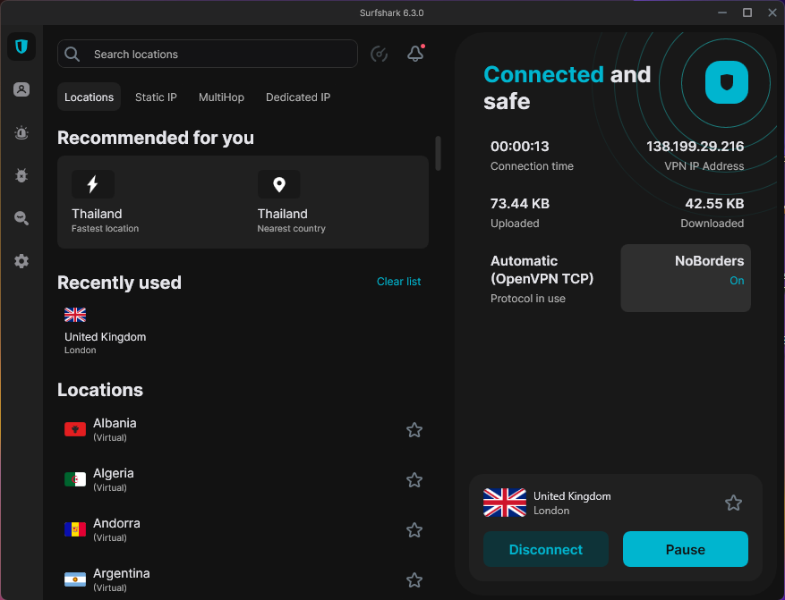

### Privacy Feature Comparison

| Feature | ProtonVPN Free | Surfshark Premium |
|---------|----------------|-------------------|
| No-Logs Policy | ✅ | ✅ |
| Kill Switch | ✅ | ✅ |
| DNS Leak Protection | ✅ | ✅ |
| Ad Blocker | ❌ | ✅ (CleanWeb) |
| Alternative Email | ❌ | ✅ |
| Alternative ID | ❌ | ✅ |
| Multi-Hop | ❌ | ✅ |
| Rotating IP | ❌ | ✅ |
| Server Locations | 3 countries | 100+ countries |
| Simultaneous Devices | 1 | Unlimited |

---

## Performance Analysis

### Step 8: Performance Testing

#### Without VPN:
1. Conducted speed test at [speedtest.net](https://www.speedtest.net)
2. Results:
   - **Download Speed:** 6.21 Mbps
   - **Upload Speed:** 0.81 Mbps
   - **Ping:** 82 ms

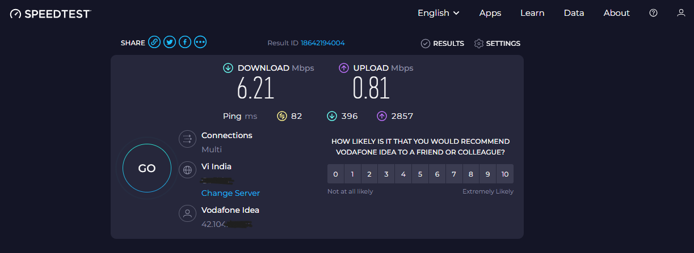

#### With VPN Connected:
1. Conducted speed test while connected to VPN
2. Results:
   - **Download Speed:** 17.12 Mbps
   - **Upload Speed:** 2.22 Mbps
   - **Ping:** 318 ms

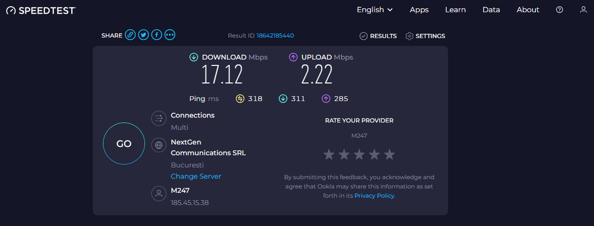

#### Performance Analysis:
- **Speed Improvement:** Surprisingly, download speed increased by 175% (from 6.21 Mbps to 17.12 Mbps) and upload speed increased by 174% (from 0.81 Mbps to 2.22 Mbps). This unusual improvement suggests the ISP may be throttling certain traffic that the VPN successfully bypasses.
- **Latency Increase:** Ping increased significantly by 236 ms (from 82 ms to 318 ms), approximately a 288% increase, which is expected due to VPN encryption overhead and routing through remote servers.
- **Browsing Experience:** General web browsing should remain smooth given the improved bandwidth, though page load times may be slightly affected by the higher latency.
- **Streaming:** HD streaming is comfortably supported with 17.12 Mbps download speed. 4K streaming may experience occasional buffering depending on the platform's requirements (typically 15-25 Mbps for 4K).
- **Gaming:** The high ping of 318 ms will noticeably impact online gaming, especially competitive games requiring quick reactions. Turn-based or casual games should remain playable, but first-person shooters and real-time strategy games may feel laggy.

### Step 9: Connection Stability Testing

1. Maintained VPN connection for extended period (1+ hour)
2. Monitored for disconnections or IP leaks
3. Results:
   - Connection remained stable throughout testing
   - No unexpected disconnections observed
   - Kill switch activated successfully during manual disconnect test

---

## VPN Benefits and Limitations

### Benefits of Using a VPN

#### 1. **Privacy Protection**
- Masks real IP address from websites and online services
- Prevents ISP from monitoring browsing activities
- Protects against tracking by advertisers and data brokers

#### 2. **Security Enhancement**
- Encrypts all internet traffic end-to-end
- Protects data on public Wi-Fi networks
- Prevents man-in-the-middle attacks
- Secures sensitive information (passwords, financial data)

#### 3. **Geo-Restriction Bypass**
- Access content blocked in your region
- Stream services from different countries
- Bypass workplace or school network restrictions

#### 4. **Censorship Circumvention**
- Access blocked websites in restrictive countries
- Bypass government-imposed internet censorship
- Maintain access to social media and news sites

#### 5. **Prevent Bandwidth Throttling**
- ISPs cannot see specific activities to throttle
- Maintains consistent connection speeds
- Improves streaming and download performance

#### 6. **Anonymous Torrenting**
- Hides P2P activity from ISP
- Protects against copyright notices
- Maintains privacy when downloading files

### Limitations of VPNs

#### 1. **Performance Impact**
- Reduced internet speeds due to encryption overhead
- Increased latency, especially with distant servers
- May impact real-time applications (gaming, video calls)

#### 2. **Cost Considerations**
- Free VPNs have limited features and server locations
- Premium VPNs require monthly/yearly subscriptions
- Multiple device protection increases costs

#### 3. **Limited Anonymity**
- VPN provider can potentially see your activity
- Not completely anonymous (requires trust in provider)
- Cannot protect against browser fingerprinting

#### 4. **Legal and Policy Restrictions**
- VPNs banned or restricted in some countries
- May violate terms of service for certain platforms
- Not effective against malware or phishing attacks

#### 5. **Technical Limitations**
- Requires installation and configuration
- May experience connection drops
- Not all devices easily support VPN connections
- Can interfere with some applications or services

#### 6. **False Sense of Security**
- VPN alone doesn't guarantee complete privacy
- Still vulnerable to compromised devices
- Requires complementary security practices

#### 7. **Trust Issues**
- Free VPNs may log data or sell information
- Provider's jurisdiction affects privacy guarantees
- No way to independently verify no-logs claims

### Best Practices for VPN Usage

1. **Choose Reputable Providers:** Select VPNs with proven track records and transparent policies
2. **Enable Kill Switch:** Always activate to prevent IP leaks
3. **Use Strong Protocols:** Prefer WireGuard or OpenVPN over older protocols
4. **Combine with Other Tools:** Use alongside antivirus, firewall, and secure browsers
5. **Verify Connections:** Regularly check for DNS and IP leaks
6. **Update Regularly:** Keep VPN client software up to date
7. **Avoid Free VPNs for Sensitive Tasks:** Use paid services for banking or confidential work
8. **Read Privacy Policy:** Understand what data the provider collects

---

## Conclusion

This hands-on VPN setup and analysis provided valuable insights into privacy protection tools. Key takeaways include:

### Technical Understanding:
- Successfully configured and connected ProtonVPN on Windows 11
- Verified IP masking and traffic encryption functionality
- Measured performance impact of VPN usage
- Explored advanced privacy features in premium VPN services

### Privacy Insights:
- VPNs are effective tools for protecting online privacy and security
- Encryption prevents ISP monitoring and protects data on untrusted networks
- Premium features like Alternative ID and masked email enhance anonymity
- Multiple layers of protection (Multi-Hop, Rotating IP) significantly improve privacy

### Practical Considerations:
- Performance trade-offs are manageable for most use cases
- Free tier limitations make premium services worthwhile for serious privacy needs
- VPNs are most effective when combined with good security practices
- Not a silver bullet—requires understanding of capabilities and limitations

### Future Recommendations:
1. Consider upgrading to premium VPN for full feature access
2. Implement VPN on mobile devices for comprehensive protection
3. Use VPN consistently, especially on public networks
4. Explore additional privacy tools (Tor, encrypted messaging, password managers)
5. Stay informed about emerging privacy threats and solutions

VPNs represent a crucial component of modern digital privacy, but should be part of a broader security strategy that includes strong passwords, two-factor authentication, software updates, and privacy-conscious browsing habits.

---

## References

- [ProtonVPN Official Documentation](https://protonvpn.com/support/)
- [Surfshark Privacy Features](https://surfshark.com/features)
- [What Is My IP Address](https://whatismyipaddress.com)
- [WireGuard Protocol Documentation](https://www.wireguard.com)
- [NIST Encryption Standards](https://csrc.nist.gov)

---
